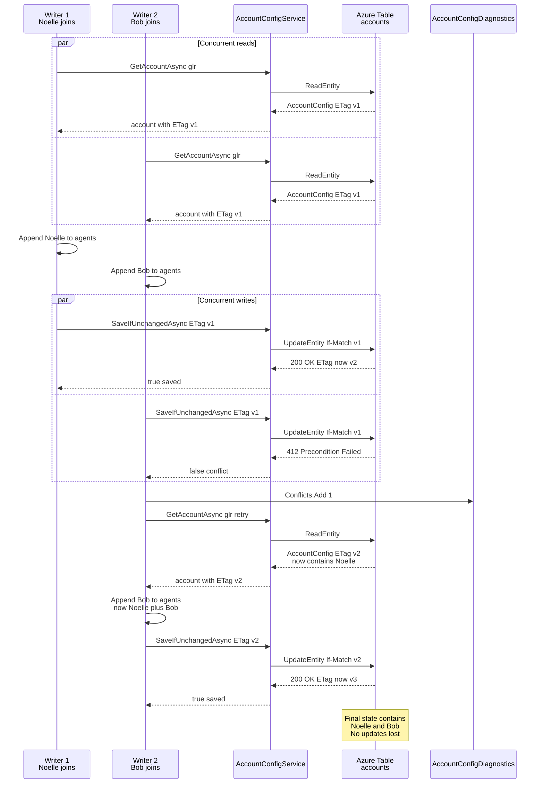

# AccountConfig ETag concurrency

Two concurrent brokerage join writers racing on the same `account.json`, reusing the existing `ITokenStore` ETag pattern. One writer succeeds on first attempt; the other gets 412, re-reads, and retries successfully.

