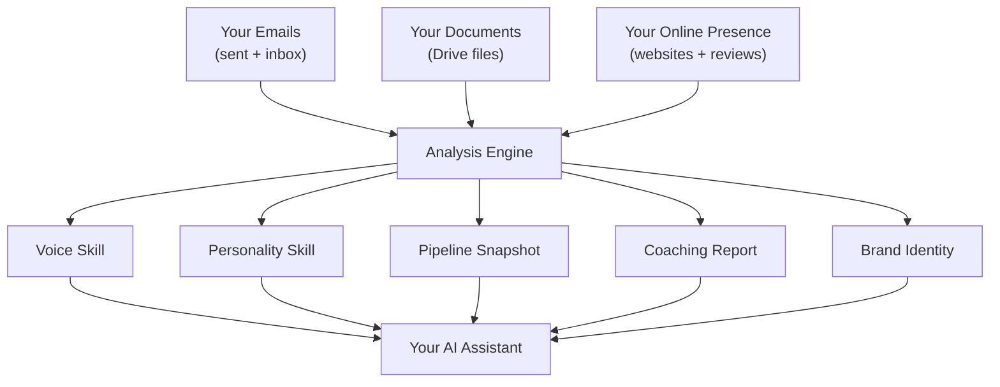
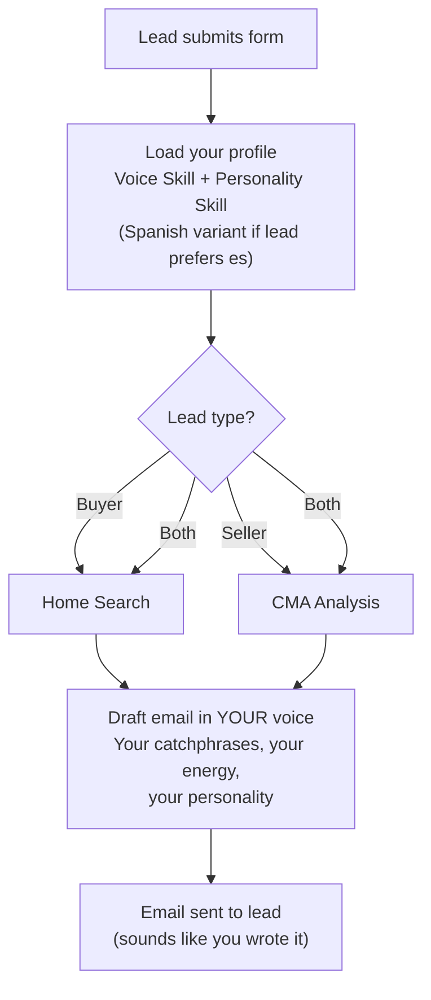

# What Happens When You Connect Your Account

When you connect your Gmail and Google Drive to Real Estate Star, we run a one-time deep analysis of your communications, documents, and online presence. This analysis builds a complete profile of who you are as an agent — your voice, your personality, your brand, your pipeline, and your gaps — so that everything the platform does on your behalf sounds and feels like you.

This document explains every dimension of that analysis: what we look at, what we learn, and how it powers the platform.

---

## The Nine Dimensions

---

### 1. Voice — How You Sound

We read your sent emails and extract the words, phrases, greetings, and sign-offs that make you *you*. If you always open with "Hope all is well!" or close with "Excited to work together!" — we capture that. If you tend to write short, punchy sentences or long, detailed explanations — we capture that too.

**What we produce:**
- Your overall tone (warm, professional, direct, conversational)
- Your formality level and pacing
- 5-10 signature phrases quoted directly from your emails
- Your preferred greeting, sign-off, and subject line style
- 11 email templates that sound like you (new lead response, offer submitted, closing day, etc.)

**How it's used:** Every email the platform sends on your behalf uses your voice profile. When a new lead comes in at 2am, the auto-response doesn't sound like a robot — it sounds like you wrote it yourself.

**Bilingual support:** If you communicate in Spanish, we build a separate Spanish voice profile from your actual Spanish emails — not a translation of your English voice. Your "Pa'lante!" stays "Pa'lante!" — we don't sanitize it to "Adelante."

---

### 2. Personality — How You Connect

Beyond what you say, we analyze *how* you make people feel. Are you the agent who celebrates with three exclamation marks and a gif, or the one who sends a thoughtful, measured congratulations? Both are effective — they're just different styles.

**What we produce:**
- Your temperament style (warm, analytical, driver, expressive)
- How you express empathy, handle conflict, deliver bad news, celebrate wins
- Your enthusiasm and confidence levels (rated 1-10 with evidence)
- Whether you're relationship-first or transaction-first
- Your unique expressions for congratulations, reassurance, and motivation
- Cultural heritage and connection points (only what's evident in your communications — we never assume)

**How it's used:** Paired with your voice, this ensures AI-generated messages match your emotional register. If your personality is warm and high-energy, we won't draft a cold, corporate email on your behalf. If you're understated and professional, we won't add emojis you'd never use.

**Why we extract cultural heritage:** If your emails naturally reference Dominican holidays or switch between English and Spanish mid-sentence, that's part of how you build rapport with clients. We preserve and use those patterns authentically — never as a template, always as *your* way of connecting.

---

### 3. Sales Pipeline — Where Your Deals Stand

We map your active leads from your email conversations. Who are you talking to? Where is each deal in the process? What needs to happen next?

**What we produce:**
- A snapshot of all identifiable leads with anonymized names
- Pipeline stage for each (new, contacted, showing, under contract, closing, closed, lost)
- Deal type (buyer, seller, rental)
- Property addresses where mentioned
- Suggested next action for each lead
- A summary table grouped by stage

**How it's used:** Your welcome email references your actual deals — not generic promises. "We found 5 active leads in your pipeline, including a buyer at the showing stage on Oak Street" tells you we've actually read your situation. The pipeline also helps calibrate coaching recommendations to your specific deal flow.

**Privacy:** Pipeline data stays on your Google Drive — we don't store your client information on our servers. The pipeline snapshot is about patterns and stages, helping you see where your deals stand at a glance.

---

### 4. Coaching — Where You Can Improve

We analyze your sent and inbox emails side-by-side to identify sales process gaps. This isn't a critique — it's a data-driven playbook for closing more deals.

**What we produce:**
- Response time analysis (how fast you reply vs industry benchmarks)
- Lead nurturing gaps (which lifecycle stages are missing follow-up sequences)
- Call-to-action quality (are your CTAs specific and urgent, or vague?)
- Objection handling patterns (how you respond to price pushback, timing concerns)
- Follow-up cadence vs benchmarks (5 touches in 2 weeks for new leads)
- Personalization score (1-10 — are your emails tailored or templated?)
- Fee and commission insights (rate positioning, negotiation patterns)
- Specific Real Estate Star features that address each gap

**How it's used:** Your welcome email highlights your #1 coaching insight with real numbers ("Your average response time is 6 hours — industry benchmark is 1-2 hours for new leads. Our auto-reply feature can close that gap immediately."). The coaching report also feeds into the cross-analysis to flag contradictions between your perceived strengths and actual patterns.

**Multilingual coaching:** If you handle leads in both English and Spanish, we analyze whether Spanish leads are getting Spanish responses, whether you have Spanish marketing campaigns, and whether there are language-specific gaps in your nurture sequences.

---

### 5. Brand Identity — What You Look Like

We extract your visual identity from your website, email signature, and online profiles. Colors, fonts, logos, headshot — everything that makes your brand recognizable.

**What we produce:**
- Brand colors (extracted from your website CSS, meta tags, email signature)
- Font families (extracted from Google Fonts links, @font-face declarations)
- Logos and headshot (downloaded from your website and email signature)
- Template recommendation (luxury, modern, warm, or professional — based on your color palette, font choices, and specialty signals)

**How it's used:** Your agent website on Real Estate Star automatically matches your existing brand. If your brokerage uses navy and gold with serif fonts, your site will feel like an extension of your brand — not a generic template with your name slapped on it.

**No AI involved:** This analysis is entirely deterministic — pattern matching on HTML and CSS. No AI interpretation, no hallucination risk. What you see is what's actually on your website.

---

### 6. Marketing Style — How You Promote

Your marketing emails (just listed, open house, market updates) have a different voice than your regular client communication. We capture that distinction.

**What we produce:**
- Campaign types you run (listing announcements, market updates, buyer alerts, newsletters)
- Email design patterns (layout, image usage, CTA placement)
- Marketing voice (how it differs from your personal communication)
- Audience segmentation (how you target buyers vs sellers, price tiers)
- Brand signals (taglines, visual elements, recurring themes)

**How it's used:** When the platform generates marketing materials — listing announcements, market updates, drip campaigns — it matches your established marketing style, not your personal email voice. These are different registers, and we respect that difference.

**Client review validation:** We cross-reference your marketing themes against what clients actually say in reviews. If your marketing emphasizes "luxury" but clients consistently describe you as "approachable and down-to-earth," we flag that gap as an insight.

---

### 7. Fee Structure — Your Pricing Posture

We extract commission rates, brokerage splits, and negotiation patterns from your emails and contracts. This is internal intelligence — never shared with clients or used in client-facing communications.

**What we produce:**
- Seller-side and buyer-side commission rates (observed from email threads)
- Brokerage split model (fixed, graduated, cap)
- Fee model (percentage, flat fee, tiered, hybrid)
- Referral fee patterns
- Negotiation patterns (how you handle pushback, common concessions)
- Firmness level (always negotiates, firm, depends on deal size)

**How it's used:** Feeds into your coaching report's "Fee & Commission Insights" section. If you're consistently conceding commission without pushback, the coaching report flags it as potential money left on the table. This data stays internal — it's for your business planning, not automation.

---

### 8. Compliance — Your Legal Safety Net

We audit your current legal language against standard real estate compliance requirements and flag what's missing.

**What we produce:**
- Current legal language you use (extracted from email footers, website legal pages, documents)
- Required inclusions cross-referenced against regulations
- Agent-specific language to preserve (custom disclaimers you've crafted)
- Wording differences from standard (where your language varies — acceptable or needs update)
- Missing items with risk flags (HIGH = legally required, MEDIUM = strongly recommended, LOW = best practice)

**What we check for:**
- Equal Housing Opportunity statement
- State real estate license number disclosure
- Brokerage affiliation disclosure
- Anti-discrimination language (Fair Housing Act)
- MLS/NAR member disclosure
- Cookie consent and privacy policy (for your website)

**How it's used:** Flags compliance gaps so you can address them before they become problems. This is a diagnostic tool — surfacing what's missing so you can act on it proactively.

---

### 9. Cross-Analysis — The Full Picture

After all eight analyses complete independently, we run a final synthesis that cross-references their findings. This catches things no single analysis could see.

**What we produce:**
- **Enriched coaching insights:** Your coaching report gains context from your personality and pipeline. Instead of "your response time is slow," it becomes "your warm, relationship-first style means you write detailed responses that take time — but your pipeline shows 3 leads went cold during the showing-to-contract transition. Consider using your signature phrase as a quick acknowledgment to buy time for your thorough follow-up."
- **Contradiction flags:** If your personality profile says "highly responsive" but your coaching analysis found 24-hour gaps, we flag the mismatch. These aren't failures — they're diagnostic insights that help you understand where perception and behavior diverge.
- **Strengths summary:** A quick-reference card of your top traits, signature phrases, pipeline health, and review score — used in your welcome email to celebrate what's working.

**How it's used:** The enriched coaching report replaces the generic version. Contradictions are flagged internally for future dashboard display. Your strengths summary appears in your welcome email as a personalized highlight reel.

---

## What Powers Your Leads

When a lead submits a form on your agent website, the platform uses your activation profile to respond authentically:

Every lead response is shaped by your voice, personality, coaching insights, and brand identity — all extracted from your actual communications during activation.

---

## Your Data, Your Control

- **Your data stays on your Google Drive.** We don't copy your emails or documents to our servers — analysis results are stored back in your own Drive.
- **Ongoing inbox monitoring powers lead follow-ups.** After activation, we continue watching your inbox to automatically send follow-up emails to leads on your behalf, using your voice and personality.
- **Fee and commission data stays internal.** It's never used in client-facing communications.
- **Cultural heritage is evidence-based only.** We extract what's in your communications — we never assume identity from your name.
- **Compliance flags are recommendations,** not legal advice. Always consult your broker or attorney for compliance questions.
- **Bilingual skills are authentic,** built from your actual Spanish communications — not translations of your English voice.
