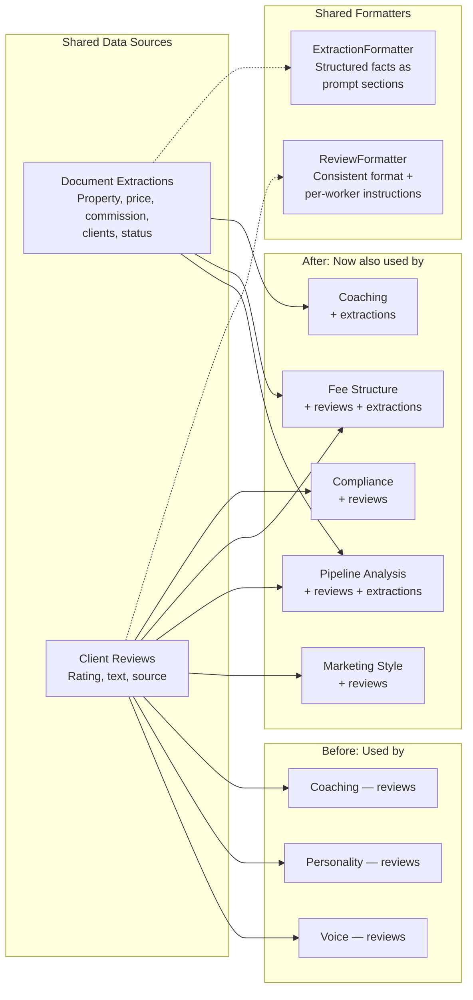

# Activation Data Enrichment

How shared data sources (extraction records, client reviews) flow into synthesis workers before and after the optimization. Workers that previously operated on raw emails alone now receive pre-extracted facts and client review context.

