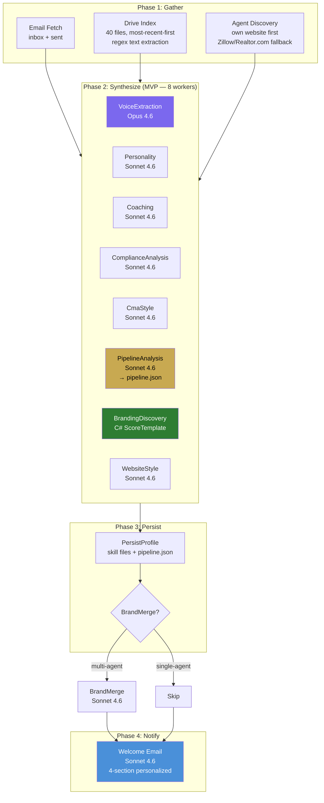
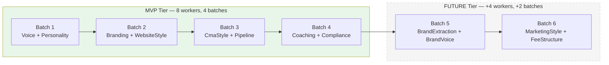
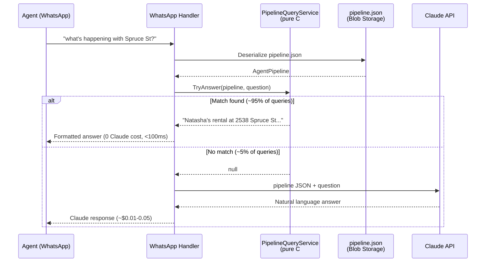
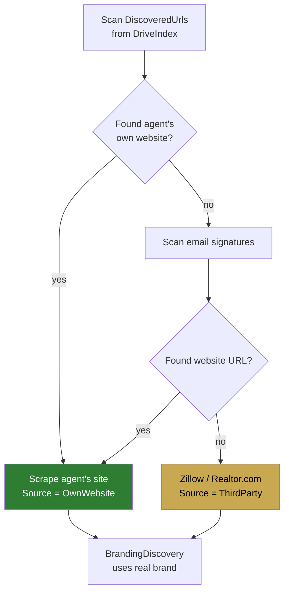
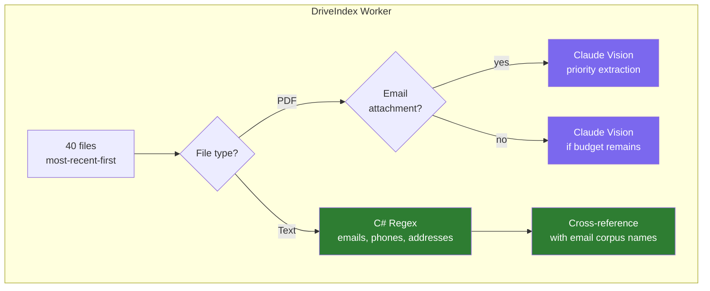
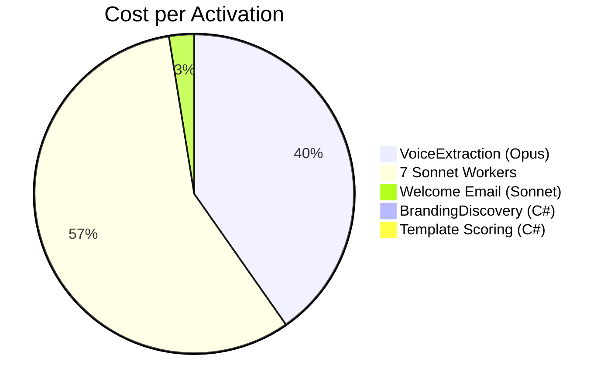

# Activation Pipeline MVP Redesign

Architecture diagrams for the MVP tier activation pipeline redesign.

## MVP Tier Pipeline Flow

## Tier-Conditional Worker Dispatch

## Pipeline Query Fast Path (WhatsApp)

## Agent Discovery Priority

## Drive Index C# Optimizations

## Cost Comparison

