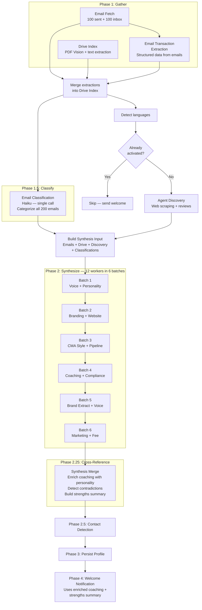

# Activation Pipeline Data Flow

How data flows through the 6-phase activation pipeline, including the new email classification (Phase 1.5) and synthesis merge (Phase 2.25) steps.

```mermaid
flowchart TD
    subgraph Phase1 ["Phase 1: Gather"]
        EF["Email Fetch<br/>100 sent + 100 inbox"]
        DI["Drive Index<br/>PDF Vision + text extraction"]
        ETX["Email Transaction<br/>Extraction<br/>Structured data from emails"]
    end

    EF --> ETX
    EF --> MERGE["Merge extractions<br/>into Drive Index"]
    DI --> MERGE
    ETX --> MERGE

    subgraph Phase15 ["Phase 1.5: Classify"]
        EC["Email Classification<br/>Haiku — single call<br/>Categorize all 200 emails"]
    end

    MERGE --> EC
    MERGE --> LANG["Detect languages"]
    LANG --> P0{"Already<br/>activated?"}
    P0 -->|Yes| SKIP["Skip — send welcome"]
    P0 -->|No| AD["Agent Discovery<br/>Web scraping + reviews"]

    EC --> SI["Build Synthesis Input<br/>Emails + Drive + Discovery<br/>+ Classifications"]
    AD --> SI

    subgraph Phase2 ["Phase 2: Synthesize — 12 workers in 6 batches"]
        direction LR
        B1["Batch 1<br/>Voice + Personality"]
        B2["Batch 2<br/>Branding + Website"]
        B3["Batch 3<br/>CMA Style + Pipeline"]
        B4["Batch 4<br/>Coaching + Compliance"]
        B5["Batch 5<br/>Brand Extract + Voice"]
        B6["Batch 6<br/>Marketing + Fee"]
    end

    SI --> B1
    B1 --> B2
    B2 --> B3
    B3 --> B4
    B4 --> B5
    B5 --> B6

    subgraph Phase225 ["Phase 2.25: Cross-Reference"]
        SM["Synthesis Merge<br/>Enrich coaching with personality<br/>Detect contradictions<br/>Build strengths summary"]
    end

    B6 --> SM

    SM --> CD["Phase 2.5: Contact Detection"]
    CD --> PP["Phase 3: Persist Profile"]
    PP --> WN["Phase 4: Welcome Notification<br/>Uses enriched coaching +<br/>strengths summary"]
```
