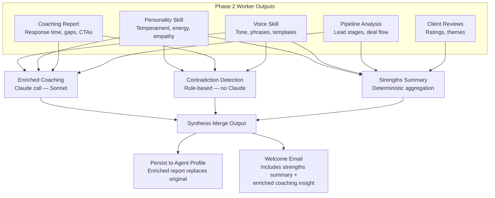

# Activation Synthesis Merge

How the Phase 2.25 synthesis merge cross-references independent worker outputs to produce enriched coaching, contradiction detection, and a strengths summary.

```mermaid
flowchart TD
    subgraph Inputs ["Phase 2 Worker Outputs"]
        VS["Voice Skill<br/>Tone, phrases, templates"]
        PS["Personality Skill<br/>Temperament, energy, empathy"]
        CR["Coaching Report<br/>Response time, gaps, CTAs"]
        PL["Pipeline Analysis<br/>Lead stages, deal flow"]
        RV["Client Reviews<br/>Ratings, themes"]
    end

    VS --> ENRICH["Enriched Coaching<br/>Claude call — Sonnet"]
    PS --> ENRICH
    CR --> ENRICH
    PL --> ENRICH

    PS --> CONTRA["Contradiction Detection<br/>Rule-based — no Claude"]
    CR --> CONTRA
    VS --> CONTRA

    PS --> STRENGTHS["Strengths Summary<br/>Deterministic aggregation"]
    VS --> STRENGTHS
    PL --> STRENGTHS
    RV --> STRENGTHS

    ENRICH --> OUT["Synthesis Merge Output"]
    CONTRA --> OUT
    STRENGTHS --> OUT

    OUT --> PERSIST["Persist to Agent Profile<br/>Enriched report replaces original"]
    OUT --> WELCOME["Welcome Email<br/>Includes strengths summary +<br/>enriched coaching insight"]
```
