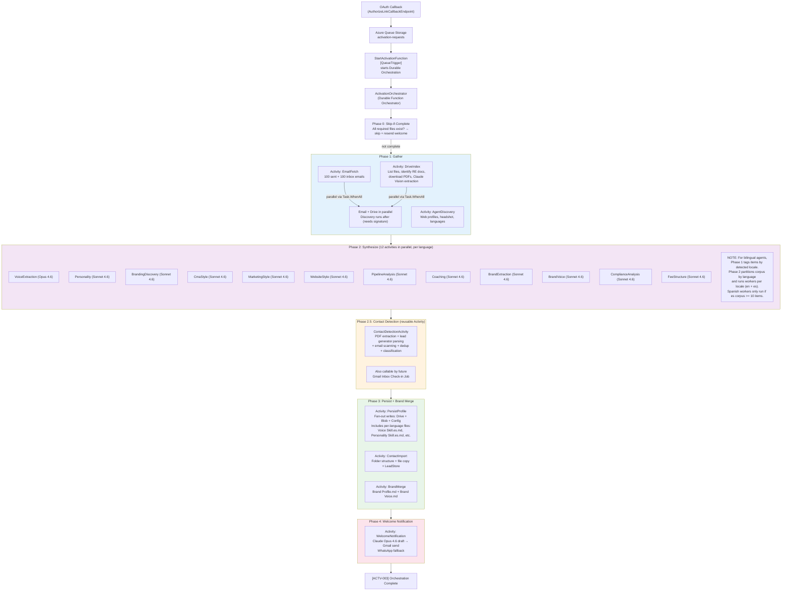
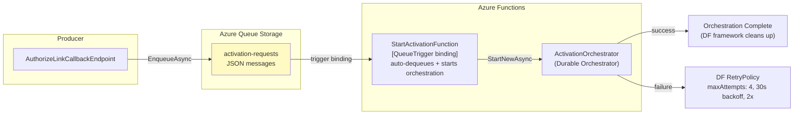
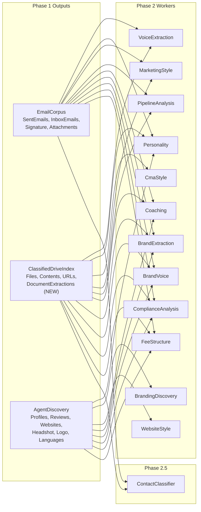
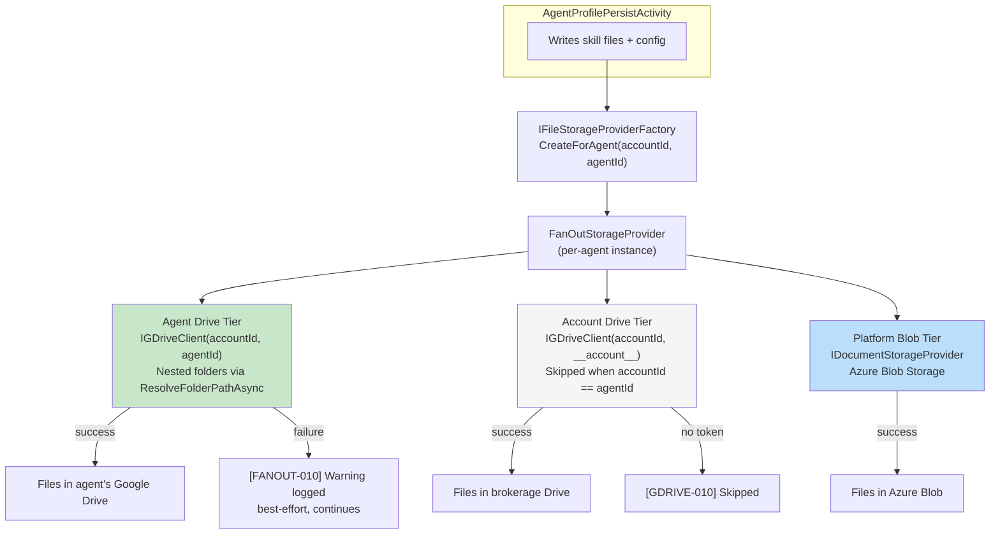
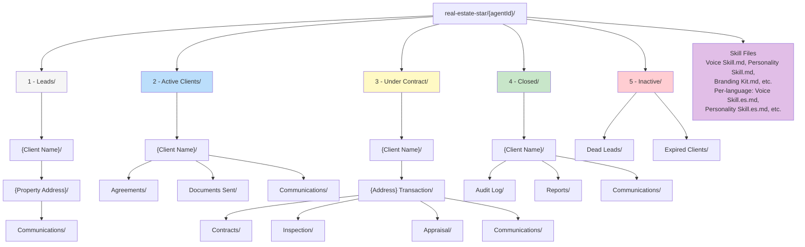
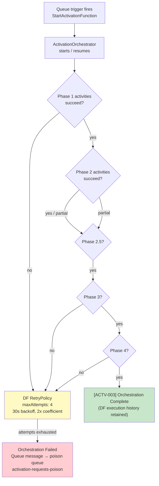
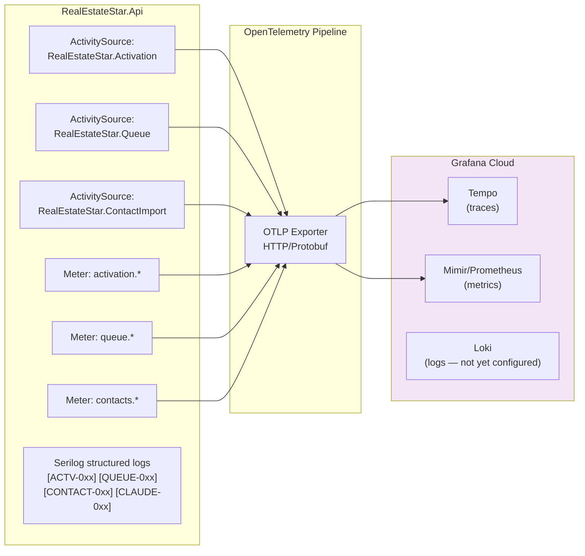

# Agent Activation Pipeline

Triggered when an agent completes Google OAuth via the OAuth Authorization Link flow.
The pipeline runs as a Durable Function orchestration (`ActivationOrchestrator`) started by a Queue-triggered Azure Function (`StartActivationFunction`) bound to the `activation-requests` queue.

---

## 6-Phase Overview



---

## Queue Trigger Architecture



**Resilience:**
- No polling loop — Azure Functions queue trigger binding handles dequeue automatically
- Checkpoint/resume handled by Durable Functions execution history (stored in Azure Table Storage)
- Failed activities retry via DF `RetryPolicy` (maxAttempts: 4, 30s backoff, 2x coefficient)
- Poison messages move to `activation-requests-poison` after 5 failures (Azure Queue built-in)
- Full observability: `[QUEUE-001]` enqueue, `[QUEUE-002]` trigger, `[ACTV-003]` complete

---

## Data Flow



---

## Storage Fan-Out Architecture



---

## Google Drive Folder Structure



---

## Skip-if-Complete Check (Phase 0)

Checks for the existence of all required files before running the full pipeline.
If all are present, the welcome notification is re-sent (idempotent) and the pipeline exits.

**Required per-agent files** (`real-estate-star/{agentId}/`):

| File | Phase |
|------|-------|
| `Voice Skill.md` | Phase 2 |
| `Personality Skill.md` | Phase 2 |
| `Marketing Style.md` | Phase 2 |
| `Sales Pipeline.md` | Phase 2 |
| `Coaching Report.md` | Phase 2 |
| `Agent Discovery.md` | Phase 1 |
| `Branding Kit.md` | Phase 2 |
| `Email Signature.md` | Phase 1 |
| `headshot.jpg` | Phase 1 |
| `Drive Index.md` | Phase 1 |

**Required per-account files** (`real-estate-star/{accountId}/`):

| File | Phase |
|------|-------|
| `Brand Profile.md` | Phase 3 |
| `Brand Voice.md` | Phase 3 |

---

## Checkpoint Strategy

After each phase, a checkpoint JSON is written to `real-estate-star/{agentId}/activation/`:

- `checkpoint-phase1-gather.json` — corpus hash + stats (email count, drive file count, websites found)
- `checkpoint-phase2-synthesis.json` — worker status map (`completed` / `skipped` per worker)

Checkpoints are **cleared before a fresh run** and **deleted after successful completion**.
They serve as observability artifacts for debugging failed activations in storage.

**Individual worker failures are non-fatal** — `RunSafeAsync` wraps each Phase 2 worker
so one failure doesn't abort the whole pipeline. The output for that worker is `null`.

---

## Resilience & Retry Strategy



**Retry behaviors:**
- **All activity failures:** DF `RetryPolicy` retries up to 4 times with 30s initial backoff and 2x coefficient before marking the orchestration failed.
- **Phase 2 partial failure:** Individual synthesis activities wrapped in `try/catch` inside `Task.WhenAll` — one failure does not abort other parallel activities. Pipeline continues with null outputs for failed workers.
- **Phase 3 failure:** `WriteOrUpdateAsync` is idempotent — existing files are overwritten, not duplicated. Safe to replay.
- **Phase 4 failure:** Welcome notification activity has idempotency check (`Welcome Sent.md`). Safe to replay via DF execution history.
- **GDrive auth errors:** `WithRetryOnAuthErrorAsync` refreshes OAuth token and retries once per call.
- **Claude API errors:** Polly retry policy with exponential backoff (configured per `HttpClient`).
- **Checkpoint/resume:** Handled automatically by DF execution history stored in Azure Table Storage — no manual checkpoint JSON files needed.

---

## Observability



**Activation spans:**
- `activation.pipeline` — root span (tags: `accountId`, `agentId`, `outcome`)
- `activation.phase1.gather` — Phase 1 (tags: `outcome`, email count, file count)
- `activation.phase2.synthesize` — Phase 2 (tags: `outcome`, worker count)
- `activation.phase2_5.classify` — Phase 2.5 (tags: contacts found, stages)
- `activation.phase3.persist` — Phase 3 (tags: `outcome`, files written)
- `activation.phase4.notify` — Phase 4 (tags: `outcome`, channel used)

**Queue spans:**
- `queue.enqueue` / `queue.dequeue` / `queue.complete` (tags: `queue.name`, `message.id`)

**Contact import spans:**
- `contact-import.pdf-extract` — per PDF (tags: `file_id`, `document_type`)
- `contact-import.email-extract` — per batch
- `contact-import.classify` — classification pass
- `contact-import.persist` — folder creation + file copy

**Metrics:**
| Metric | Type | Dimensions |
|--------|------|------------|
| `activation.started` | Counter | accountId |
| `activation.completed` | Counter | accountId |
| `activation.failed` | Counter | accountId |
| `activation.duration` | Histogram | — |
| `queue.messages.enqueued` | Counter | queue.name |
| `queue.messages.completed` | Counter | queue.name |
| `queue.messages.failed` | Counter | queue.name |
| `queue.processing.duration` | Histogram | — |
| `contacts.imported` | Counter | stage |
| `pdfs.processed` | Counter | — |
| `claude.input_tokens` | Counter | pipeline, model |
| `claude.output_tokens` | Counter | pipeline, model |
| `claude.duration` | Histogram | pipeline, model |

**Error code prefixes:**
| Prefix | Component |
|--------|-----------|
| `ACTV-0xx` | Activation orchestrator |
| `ACTV-1xx` | Activation infrastructure |
| `QUEUE-0xx` | Queue operations |
| `CONTACT-0xx` | Contact import |
| `CLAUDE-0xx` | Claude API client |
| `GDRIVE-0xx` | Google Drive client |
| `PERSIST-AGENT-0xx` | Agent profile persist |
| `CFG-0xx` | Config generation |
| `WELCOME-0xx` | Welcome notification |
| `FANOUT-0xx` | Fan-out storage |
| `TOKEN-0xx` | Token store |
| `BLOB-0xx` | Blob storage |

---

## Model Selection

| Worker | Model | Rationale |
|--------|-------|-----------|
| VoiceExtraction | **Opus 4.6** | Deep communication pattern analysis — only worker that needs Opus |
| All other synthesis workers (11) | Sonnet 4.6 | Good quality at 5x lower cost than Opus |
| BrandMerge | Sonnet 4.6 | Merge/synthesis task |
| Welcome email | Opus 4.6 | Agent's first impression — quality matters |
| PDF extraction (Vision) | Sonnet 4.6 | Structured extraction from images |
| Email contact extraction | Sonnet 4.6 | Batch contact parsing |
| Lead generator parsing | Regex | No Claude needed — known formats |
| Profile scraping | Haiku 4.5 | Lightweight extraction |

**Prompt caching:** System prompts use `cache_control: {"type": "ephemeral"}` for 90% input token discount on subsequent calls within the same model.

---

## Performance Benchmarks (2026-03-31)

| Phase | Duration (personal Gmail) | Duration (real agent) |
|-------|--------------------------|----------------------|
| Phase 1: Gather | ~42s | ~90s (58 docs) |
| Phase 2: Synthesize | ~52s | ~60s |
| Phase 3: Persist + Brand Merge | ~55s | ~60s |
| Phase 4: Welcome | ~9s | ~9s |
| **Total** | **~2 min 39s** | **~3 min 39s** |

**Bottlenecks:**
1. Phase 1 Drive file reading — sequential, ~1-8s per file
2. Brand merge Claude call — single 47s call
3. Coaching worker — 54K input tokens (context trimming opportunity)

---

## Cost Per Activation

| Component | Personal Gmail | Real Agent |
|-----------|---------------|------------|
| Existing pipeline (12 workers + welcome) | $0.47 | $0.80-1.20 |
| Contact import (PDF + email extraction) | — | $0.90-4.50 |
| Container compute (~3-5 min) | $0.02 | $0.02 |
| **Total** | **$0.49** | **$1.72-5.72** |

---

## Project Structure

```
RealEstateStar.Functions/
  Activation/
    StartActivationFunction.cs                    -- [QueueTrigger] starts Durable Orchestration
    ActivationOrchestrator.cs                     -- Durable orchestrator: Phase 1-4 coordination
  Leads/
    StartLeadProcessingFunction.cs                -- [QueueTrigger] starts lead orchestration
    LeadOrchestratorFunction.cs                   -- Durable orchestrator: full lead pipeline

Workers/Activation/
  RealEstateStar.Workers.Activation.EmailFetch/          -- Phase 1: Gmail corpus fetch (activity)
  RealEstateStar.Workers.Activation.DriveIndex/          -- Phase 1: Drive indexing + PDF extraction (activity)
  RealEstateStar.Workers.Activation.AgentDiscovery/      -- Phase 1: web scraping + profile discovery (activity)
  RealEstateStar.Workers.Activation.VoiceExtraction/     -- Phase 2 activity (Opus 4.6)
  RealEstateStar.Workers.Activation.Personality/         -- Phase 2 activity
  RealEstateStar.Workers.Activation.BrandingDiscovery/   -- Phase 2 activity
  RealEstateStar.Workers.Activation.CmaStyle/            -- Phase 2 activity
  RealEstateStar.Workers.Activation.MarketingStyle/      -- Phase 2 activity
  RealEstateStar.Workers.Activation.WebsiteStyle/        -- Phase 2 activity
  RealEstateStar.Workers.Activation.PipelineAnalysis/    -- Phase 2 activity
  RealEstateStar.Workers.Activation.Coaching/            -- Phase 2 activity
  RealEstateStar.Workers.Activation.BrandExtraction/     -- Phase 2 activity
  RealEstateStar.Workers.Activation.BrandVoice/          -- Phase 2 activity
  RealEstateStar.Workers.Activation.ComplianceAnalysis/  -- Phase 2 activity
  RealEstateStar.Workers.Activation.FeeStructure/        -- Phase 2 activity
Activities/Activation/
  RealEstateStar.Activities.Activation.PersistAgentProfile/   -- Phase 3
  RealEstateStar.Activities.Activation.BrandMerge/            -- Phase 3
  RealEstateStar.Activities.Activation.ContactImportPersist/  -- Phase 3
Activities/Leads/
  RealEstateStar.Activities.Lead.ContactDetection/            -- Phase 2.5 (reusable)
    ContactDetectionActivity.cs      -- orchestrates extraction + classification
    PdfContactExtractor.cs           -- Claude Vision extraction from PDF pages
    EmailContactExtractor.cs         -- lead generator regex + Claude Sonnet batch
    ContactClassifier.cs             -- dedup + stage classification
    LeadGeneratorPatterns.cs         -- known sender domains + parsing templates
Services/Activation/
  RealEstateStar.Services.AgentConfig/           -- Config generation
  RealEstateStar.Services.BrandMerge/            -- Brand merge logic
  RealEstateStar.Services.WelcomeNotification/   -- Phase 4
```

**Dependency rule**: All individual Activation workers depend only on `Domain` + `Workers.Shared`.
The Orchestrator (in `RealEstateStar.Functions`) depends on all workers + activities.
Activities depend on Domain + may call Clients (via factory for per-agent context).
