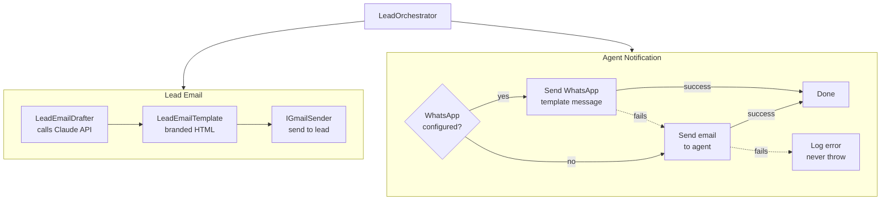

# Agent Notification Flow

Two notification channels: branded email to the lead, and WhatsApp (with email fallback) to the agent.

```mermaid
flowchart TD
    subgraph LeadEmail ["Lead Email"]
        Draft["LeadEmailDrafter<br/>calls Claude API"] --> Template["LeadEmailTemplate<br/>branded HTML"]
        Template --> Gmail["IGmailSender<br/>send to lead"]
    end

    subgraph AgentNotify ["Agent Notification"]
        WA{"WhatsApp<br/>configured?"}
        WA -->|"yes"| Try["Send WhatsApp<br/>template message"]
        WA -->|"no"| Fallback["Send email<br/>to agent"]
        Try -->|"success"| Done["Done"]
        Try -.->|"fails"| Fallback
        Fallback -->|"success"| Done
        Fallback -.->|"fails"| Log["Log error<br/>never throw"]
    end

    Orch["LeadOrchestrator"] --> LeadEmail
    Orch --> AgentNotify
```
