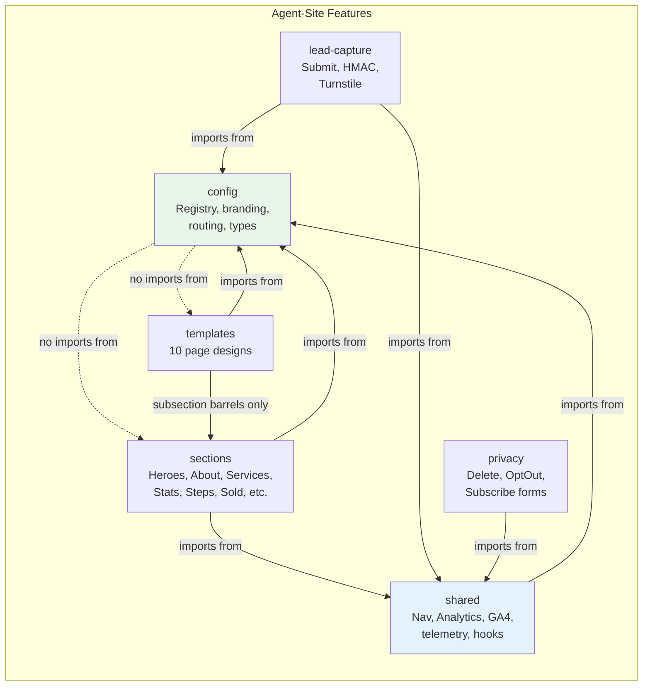

# Agent-Site Feature Isolation

How the 6 feature modules in the agent-site app relate to each other, with allowed and blocked import directions.

```mermaid
flowchart LR
    subgraph Features ["Agent-Site Features"]
        Config["config<br/>Registry, branding,<br/>routing, types"]
        Shared["shared<br/>Nav, Analytics, GA4,<br/>telemetry, hooks"]
        Sections["sections<br/>Heroes, About, Services,<br/>Stats, Steps, Sold, etc."]
        Templates["templates<br/>10 page designs"]
        LeadCapture["lead-capture<br/>Submit, HMAC,<br/>Turnstile"]
        Privacy["privacy<br/>Delete, OptOut,<br/>Subscribe forms"]
    end

    Config -.->|"no imports from"| Templates
    Config -.->|"no imports from"| Sections

    Shared -->|"imports from"| Config
    Sections -->|"imports from"| Config
    Sections -->|"imports from"| Shared
    Templates -->|"imports from"| Config
    Templates -->|"subsection barrels only"| Sections
    LeadCapture -->|"imports from"| Config
    LeadCapture -->|"imports from"| Shared
    Privacy -->|"imports from"| Shared

    style Config fill:#e8f5e9
    style Shared fill:#e3f2fd
```
