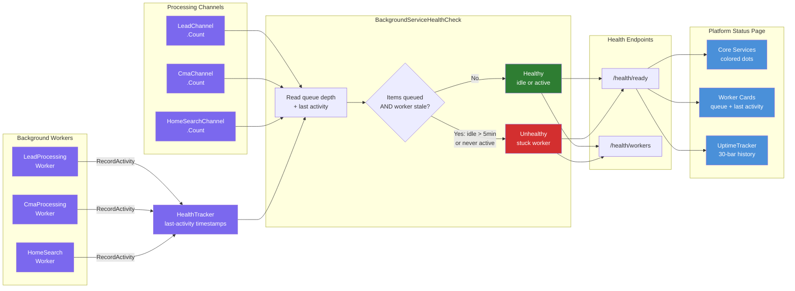

# Background Service Health Checks

How the health check system detects stuck background workers by comparing channel queue depth against worker activity timestamps.

```mermaid
flowchart LR
    subgraph Workers ["Background Workers"]
        LW["LeadProcessing<br/>Worker"]
        CW["CmaProcessing<br/>Worker"]
        HW["HomeSearch<br/>Worker"]
    end

    subgraph Channels ["Processing Channels"]
        LC["LeadChannel<br/>.Count"]
        CC["CmaChannel<br/>.Count"]
        HC["HomeSearchChannel<br/>.Count"]
    end

    Tracker["HealthTracker<br/>last-activity timestamps"]

    LW -->|"RecordActivity"| Tracker
    CW -->|"RecordActivity"| Tracker
    HW -->|"RecordActivity"| Tracker

    subgraph HealthCheck ["BackgroundServiceHealthCheck"]
        Read["Read queue depth<br/>+ last activity"]
        Decision{"Items queued<br/>AND worker stale?"}
        Healthy["Healthy<br/>idle or active"]
        Unhealthy["Unhealthy<br/>stuck worker"]
    end

    LC --> Read
    CC --> Read
    HC --> Read
    Tracker --> Read
    Read --> Decision
    Decision -->|"No"| Healthy
    Decision -->|"Yes: idle > 5min<br/>or never active"| Unhealthy

    subgraph Endpoints ["Health Endpoints"]
        Ready["/health/ready"]
        WorkersEP["/health/workers"]
    end

    Healthy --> Ready
    Unhealthy --> Ready
    Healthy --> WorkersEP
    Unhealthy --> WorkersEP

    subgraph StatusPage ["Platform Status Page"]
        Core["Core Services<br/>colored dots"]
        WorkerCards["Worker Cards<br/>queue + last activity"]
        Uptime["UptimeTracker<br/>30-bar history"]
    end

    Ready --> Core
    Ready --> WorkerCards
    Ready --> Uptime

    style LW fill:#7B68EE,color:#fff
    style CW fill:#7B68EE,color:#fff
    style HW fill:#7B68EE,color:#fff
    style LC fill:#7B68EE,color:#fff
    style CC fill:#7B68EE,color:#fff
    style HC fill:#7B68EE,color:#fff
    style Tracker fill:#7B68EE,color:#fff
    style Healthy fill:#2E7D32,color:#fff
    style Unhealthy fill:#D32F2F,color:#fff
    style Core fill:#4A90D9,color:#fff
    style WorkerCards fill:#4A90D9,color:#fff
    style Uptime fill:#4A90D9,color:#fff
```
