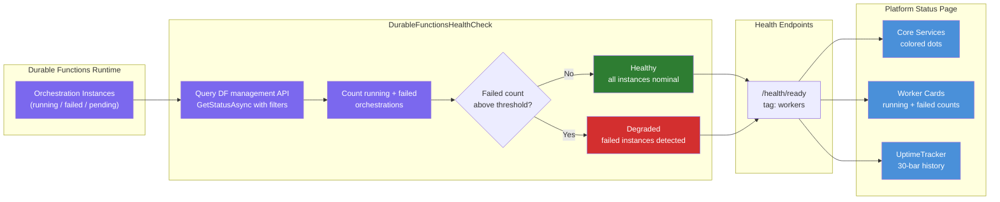

# Durable Functions Health Checks

How the health check system monitors orchestration state by querying the Durable Functions management API for running and failed instance counts.

```mermaid
flowchart LR
    subgraph DFRuntime ["Durable Functions Runtime"]
        Instances["Orchestration Instances\n(running / failed / pending)"]
    end

    subgraph HealthCheck ["DurableFunctionsHealthCheck"]
        Query["Query DF management API\nGetStatusAsync with filters"]
        Count["Count running + failed\norchestrations"]
        Decision{"Failed count\nabove threshold?"}
        Healthy["Healthy\nall instances nominal"]
        Degraded["Degraded\nfailed instances detected"]
    end

    Instances --> Query
    Query --> Count
    Count --> Decision
    Decision -->|"No"| Healthy
    Decision -->|"Yes"| Degraded

    subgraph Endpoints ["Health Endpoints"]
        Ready["/health/ready\ntag: workers"]
    end

    Healthy --> Ready
    Degraded --> Ready

    subgraph StatusPage ["Platform Status Page"]
        Core["Core Services\ncolored dots"]
        WorkerCards["Worker Cards\nrunning + failed counts"]
        Uptime["UptimeTracker\n30-bar history"]
    end

    Ready --> Core
    Ready --> WorkerCards
    Ready --> Uptime

    style Instances fill:#7B68EE,color:#fff
    style Query fill:#7B68EE,color:#fff
    style Count fill:#7B68EE,color:#fff
    style Healthy fill:#2E7D32,color:#fff
    style Degraded fill:#D32F2F,color:#fff
    style Core fill:#4A90D9,color:#fff
    style WorkerCards fill:#4A90D9,color:#fff
    style Uptime fill:#4A90D9,color:#fff
```
