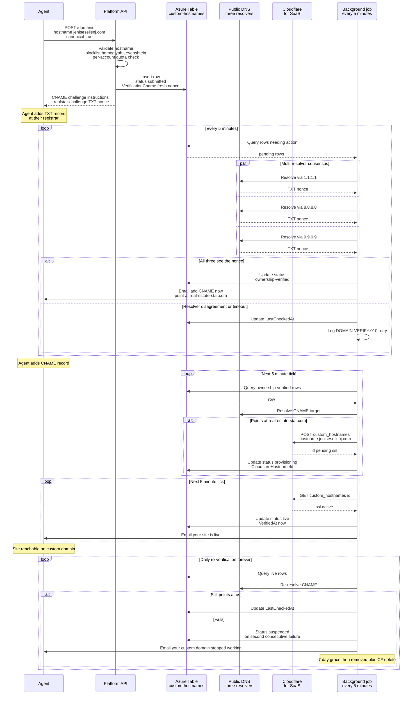

# BYOD custom domain two-phase verification

End-to-end Bring Your Own Domain lifecycle: TXT challenge for ownership proof, CNAME for routing activation, Cloudflare for SaaS provisioning, daily re-verification, and suspension/removal on DNS loss.

