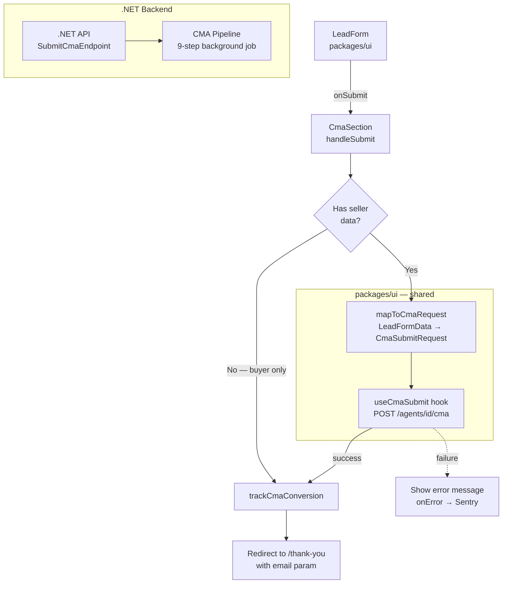

# CMA Form Submission Flow

How seller and buyer leads flow from the shared LeadForm through submission to the .NET backend.

```mermaid
flowchart TD
    Form["LeadForm<br/>packages/ui"]
    Submit["CmaSection<br/>handleSubmit"]
    IsSelling{"Has seller<br/>data?"}
    CmaApi["useCmaSubmit hook<br/>POST /agents/id/cma"]
    MapReq["mapToCmaRequest<br/>LeadFormData → CmaSubmitRequest"]
    Api[".NET API<br/>SubmitCmaEndpoint"]
    Pipeline["CMA Pipeline<br/>9-step background job"]
    Analytics["trackCmaConversion"]
    ThankYou["Redirect to /thank-you<br/>with email param"]
    Error["Show error message<br/>onError → Sentry"]

    Form -->|"onSubmit"| Submit
    Submit --> IsSelling
    IsSelling -->|"Yes"| MapReq
    IsSelling -->|"No — buyer only"| Analytics
    MapReq --> CmaApi
    CmaApi -->|"success"| Analytics
    CmaApi -.->|"failure"| Error
    Analytics --> ThankYou
    Api --> Pipeline

    subgraph "packages/ui — shared"
        CmaApi
        MapReq
    end

    subgraph ".NET Backend"
        Api
        Pipeline
    end
```
