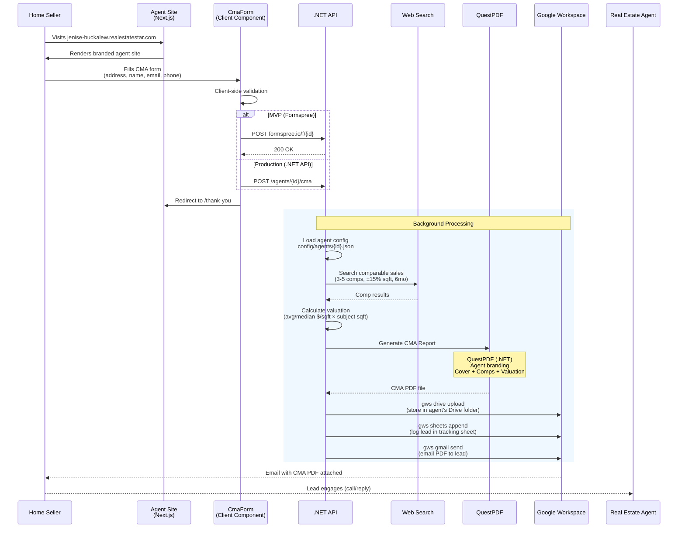
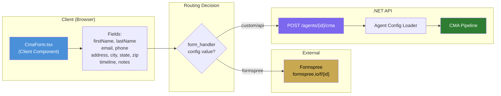

# CMA Pipeline Architecture

## End-to-End Flow

## CMA Form Data Flow

## CMA PDF Structure

| Page | Content | Data Source |
|------|---------|------------|
| 1 | Cover — title, property address, agent info | `agent.identity.*`, form data |
| 2 | Subject property overview | Form submission + enrichment |
| 3 | Comparable sales table (3-5 comps) | Web search results |
| 4 | Valuation estimate (low-high range) | Calculated from comps |
| 5 | About the agent + credentials | `agent.identity.*`, content.about |

All pages use `agent.branding.*` for colors and fonts via QuestPDF styling.
