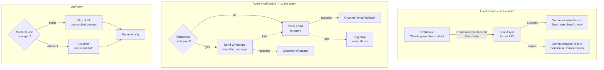

# Communication Draft/Send Split

Drafting and sending are separate activities. If sending fails on retry, the cached draft is re-sent without re-calling Claude.

```mermaid
flowchart TD
    subgraph LeadEmail ["Lead Email — to the lead"]
        Draft1["DraftAsync<br/>Claude generates content"] -->|"CommunicationRecord<br/>Sent=false"| Send1["SendAsync<br/>Gmail API"]
        Send1 -->|"success"| Done1["CommunicationRecord<br/>Sent=true, SentAt=now"]
        Send1 -.->|"failure"| Err1["CommunicationRecord<br/>Sent=false, Error=reason"]
    end

    subgraph AgentNotif ["Agent Notification — to the agent"]
        WA{"WhatsApp<br/>configured?"}
        WA -->|"yes"| TryWA["Send WhatsApp<br/>template message"]
        WA -->|"no"| Fallback["Send email<br/>to agent"]
        TryWA -->|"success"| Done2["Channel: whatsapp"]
        TryWA -.->|"fails"| Fallback
        Fallback -->|"success"| Done3["Channel: email-fallback"]
        Fallback -.->|"fails"| Log["Log error<br/>never throw"]
    end

    subgraph Retry ["On Retry"]
        Check{"ContentHash<br/>changed?"}
        Check -->|"same"| SkipDraft["Skip draft<br/>use cached content"]
        Check -->|"different"| Redraft["Re-draft<br/>new input data"]
        SkipDraft --> Resend["Re-send only"]
        Redraft --> Resend
    end
```
