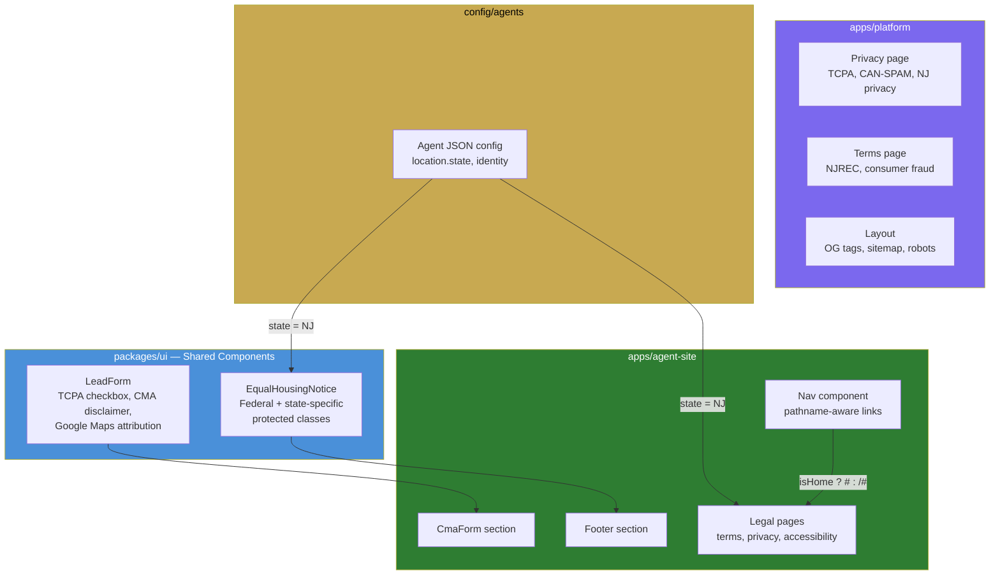

# Compliance Component Hierarchy

How shared compliance UI components are consumed by the agent-site and platform apps.

```mermaid
flowchart TD
    subgraph SharedUI ["packages/ui — Shared Components"]
        LF["LeadForm<br/>TCPA checkbox, CMA disclaimer,<br/>Google Maps attribution"]
        EHO["EqualHousingNotice<br/>Federal + state-specific<br/>protected classes"]
    end

    subgraph AgentSite ["apps/agent-site"]
        CMA["CmaForm section"]
        Footer["Footer section"]
        Legal["Legal pages<br/>terms, privacy, accessibility"]
        Nav["Nav component<br/>pathname-aware links"]
    end

    subgraph Platform ["apps/platform"]
        PPrivacy["Privacy page<br/>TCPA, CAN-SPAM, NJ privacy"]
        PTerms["Terms page<br/>NJREC, consumer fraud"]
        PLayout["Layout<br/>OG tags, sitemap, robots"]
    end

    subgraph Config ["config/agents"]
        AC["Agent JSON config<br/>location.state, identity"]
    end

    LF --> CMA
    EHO --> Footer
    AC -->|"state = NJ"| Legal
    AC -->|"state = NJ"| EHO
    Nav -->|"isHome ? # : /#"| Legal

    style SharedUI fill:#4A90D9,color:#fff
    style AgentSite fill:#2E7D32,color:#fff
    style Platform fill:#7B68EE,color:#fff
    style Config fill:#C8A951,color:#000
```
