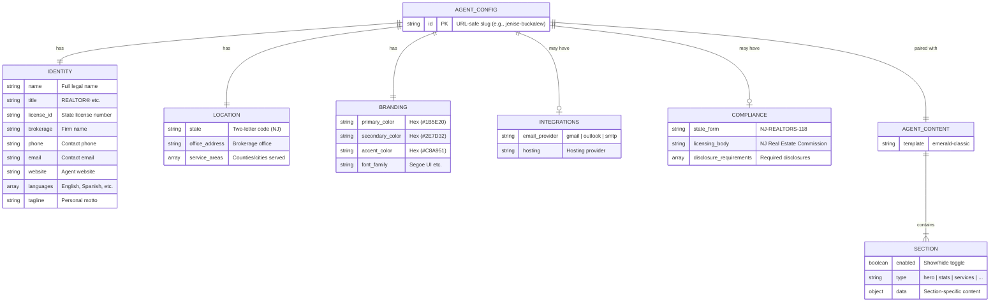
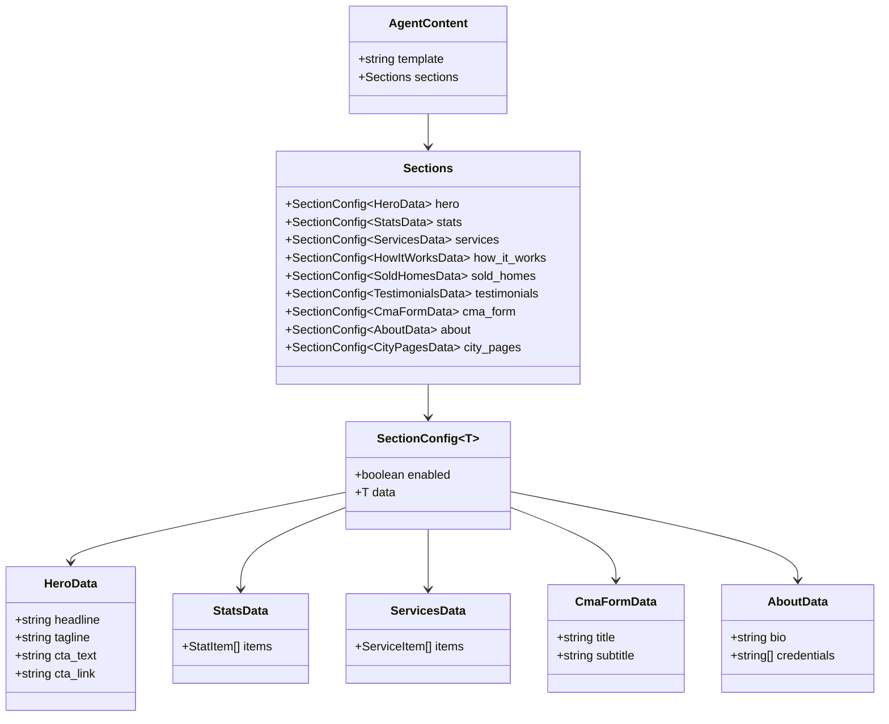
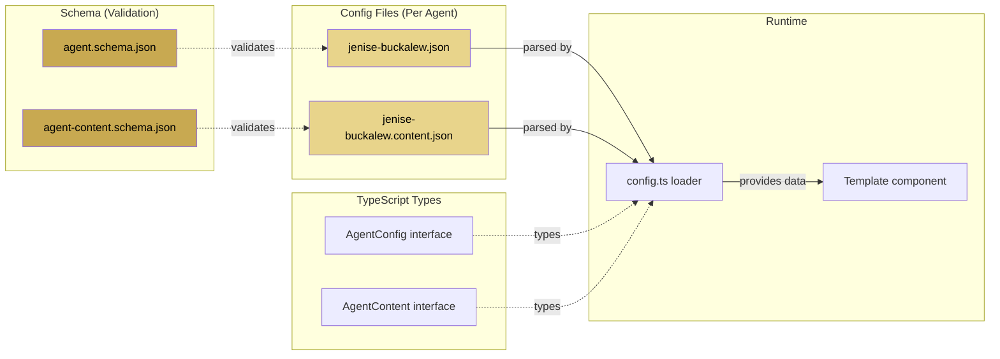

# Data Model & Relationships

## Agent Configuration Entity Model

```mermaid
erDiagram
    AGENT_CONFIG ||--|| IDENTITY : has
    AGENT_CONFIG ||--|| LOCATION : has
    AGENT_CONFIG ||--|| BRANDING : has
    AGENT_CONFIG ||--o| INTEGRATIONS : "may have"
    AGENT_CONFIG ||--o| COMPLIANCE : "may have"
    AGENT_CONFIG ||--|| AGENT_CONTENT : "paired with"
    AGENT_CONTENT ||--|{ SECTION : contains

    AGENT_CONFIG {
        string id PK "URL-safe slug (e.g., jenise-buckalew)"
    }

    IDENTITY {
        string name "Full legal name"
        string title "REALTOR® etc."
        string license_id "State license number"
        string brokerage "Firm name"
        string phone "Contact phone"
        string email "Contact email"
        string website "Agent website"
        array languages "English, Spanish, etc."
        string tagline "Personal motto"
    }

    LOCATION {
        string state "Two-letter code (NJ)"
        string office_address "Brokerage office"
        array service_areas "Counties/cities served"
    }

    BRANDING {
        string primary_color "Hex (#1B5E20)"
        string secondary_color "Hex (#2E7D32)"
        string accent_color "Hex (#C8A951)"
        string font_family "Segoe UI etc."
    }

    INTEGRATIONS {
        string email_provider "gmail | outlook | smtp"
        string hosting "Hosting provider"
    }

    COMPLIANCE {
        string state_form "NJ-REALTORS-118"
        string licensing_body "NJ Real Estate Commission"
        array disclosure_requirements "Required disclosures"
    }

    AGENT_CONTENT {
        string template "emerald-classic"
    }

    SECTION {
        boolean enabled "Show/hide toggle"
        string type "hero | stats | services | ..."
        object data "Section-specific content"
    }
```

## Section Type Reference

```mermaid
classDiagram
    class AgentContent {
        +string template
        +Sections sections
    }

    class Sections {
        +SectionConfig~HeroData~ hero
        +SectionConfig~StatsData~ stats
        +SectionConfig~ServicesData~ services
        +SectionConfig~HowItWorksData~ how_it_works
        +SectionConfig~SoldHomesData~ sold_homes
        +SectionConfig~TestimonialsData~ testimonials
        +SectionConfig~CmaFormData~ cma_form
        +SectionConfig~AboutData~ about
        +SectionConfig~CityPagesData~ city_pages
    }

    class SectionConfig~T~ {
        +boolean enabled
        +T data
    }

    class HeroData {
        +string headline
        +string tagline
        +string cta_text
        +string cta_link
    }

    class StatsData {
        +StatItem[] items
    }

    class ServicesData {
        +ServiceItem[] items
    }

    class CmaFormData {
        +string title
        +string subtitle
    }

    class AboutData {
        +string bio
        +string[] credentials
    }

    AgentContent --> Sections
    Sections --> SectionConfig~T~
    SectionConfig~T~ --> HeroData
    SectionConfig~T~ --> StatsData
    SectionConfig~T~ --> ServicesData
    SectionConfig~T~ --> CmaFormData
    SectionConfig~T~ --> AboutData
```

## File Relationships

```mermaid
flowchart LR
    subgraph "Schema (Validation)"
        agentSchema["agent.schema.json"]
        contentSchema["agent-content.schema.json"]
    end

    subgraph "Config Files (Per Agent)"
        agentJson["jenise-buckalew.json"]
        contentJson["jenise-buckalew.content.json"]
    end

    subgraph "TypeScript Types"
        agentConfig["AgentConfig interface"]
        agentContent["AgentContent interface"]
    end

    subgraph "Runtime"
        configLoader["config.ts loader"]
        template["Template component"]
    end

    agentSchema -.->|validates| agentJson
    contentSchema -.->|validates| contentJson
    agentJson -->|parsed by| configLoader
    contentJson -->|parsed by| configLoader
    agentConfig -.->|types| configLoader
    agentContent -.->|types| configLoader
    configLoader -->|provides data| template

    style agentSchema fill:#C8A951,color:#000
    style contentSchema fill:#C8A951,color:#000
    style agentJson fill:#E8D48B,color:#000
    style contentJson fill:#E8D48B,color:#000
```
