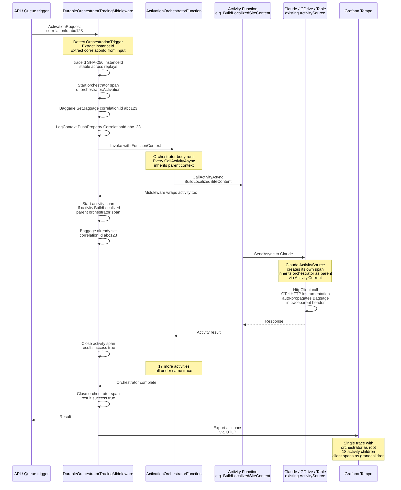

# Durable Functions trace propagation

How the R5 `DurableOrchestratorTracingMiddleware` turns an 18-activity activation into a single connected trace, with correlation ID flowing via `Baggage` instead of method parameters.

**Why it matters**: before R5, each activity function produced its own span via its client `ActivitySource` (Claude, GDrive, Azure Table, etc.) but there was no parent span binding them together. An 8-minute activation produced ~18 disconnected spans in Grafana Tempo with no way to reconstruct "this agent's activation" as one waterfall. R5 fixes this with a thin middleware layer on the DF worker host that creates an orchestrator-level parent span from the instance ID and propagates correlation ID via `Baggage` so every downstream client call inherits it automatically.

**Replay safety**: Durable Functions replays the orchestrator function on every checkpoint. Without care, each replay would produce a new orchestrator span. The middleware avoids this by seeding the trace ID from `SHA-256(instanceId)` — every replay of the same orchestration computes the same trace ID, so spans from all replays collapse into one trace. Activity spans inherit the same trace ID via `Activity.Current?.Context` parent linking.

**Correlation ID is free**: once `Baggage.SetBaggage("correlation.id", ...)` fires in the middleware, OTel's HTTP client instrumentation automatically propagates it in the `baggage` header on every outbound HTTP call. The agent's Gmail call, the Claude call, the GDrive call — all inherit the correlation ID without any code in the activity function having to thread it through. Logs inside the activity also pick it up via the `LogContext.PushProperty` that runs in the same middleware frame.

**What this unlocks**:
- **Single-click reconstruction**: given `instanceId`, Grafana Tempo returns the full 18-activity trace as one waterfall.
- **Error budget math**: orchestrator-level spans let §18.7 SLOs be defined on orchestration success rate directly, not inferred from activity counts.
- **Support runbook works**: `docs/runbooks/trace-reconstruction.md` can now say "paste the ref into Tempo" as a single step.

See design spec §5.8 for the full middleware code, the `IsReplaying` guard pattern, and the `Orchestrators_UseReplaySafeLogger` architecture test that enforces the discipline across every new orchestrator.
