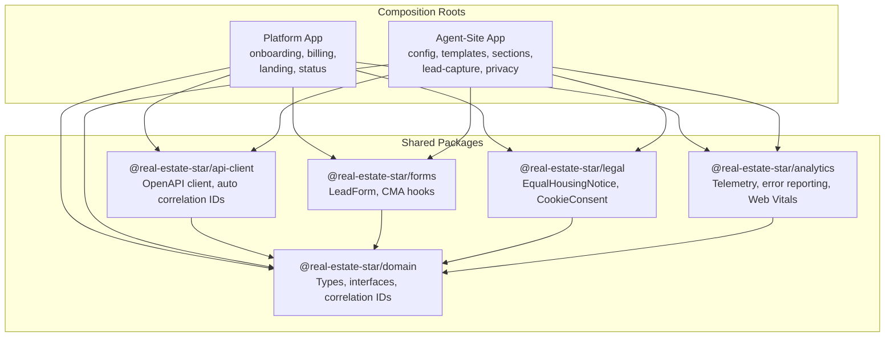

# Frontend Package Dependencies

How the 5 shared npm workspace packages relate to each other and to the two apps.

```mermaid
flowchart TD
    subgraph Apps ["Composition Roots"]
        Platform["Platform App<br/>onboarding, billing,<br/>landing, status"]
        AgentSite["Agent-Site App<br/>config, templates, sections,<br/>lead-capture, privacy"]
    end

    subgraph Packages ["Shared Packages"]
        Domain["@real-estate-star/domain<br/>Types, interfaces, correlation IDs"]
        ApiClient["@real-estate-star/api-client<br/>OpenAPI client, auto correlation IDs"]
        Forms["@real-estate-star/forms<br/>LeadForm, CMA hooks"]
        Legal["@real-estate-star/legal<br/>EqualHousingNotice, CookieConsent"]
        Analytics["@real-estate-star/analytics<br/>Telemetry, error reporting, Web Vitals"]
    end

    Platform --> Domain
    Platform --> ApiClient
    Platform --> Forms
    Platform --> Legal
    Platform --> Analytics

    AgentSite --> Domain
    AgentSite --> ApiClient
    AgentSite --> Forms
    AgentSite --> Legal
    AgentSite --> Analytics

    ApiClient --> Domain
    Forms --> Domain
    Legal --> Domain
    Analytics --> Domain
```
