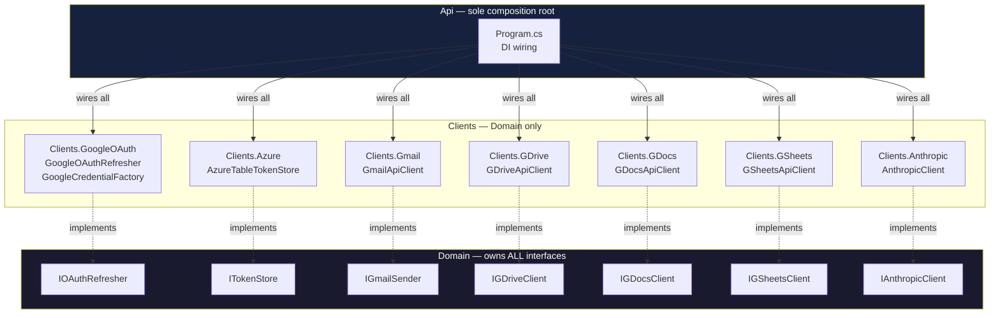

# Google Client Dependency Graph

How the Google API clients, token store, and shared infrastructure relate to each other.

```mermaid
flowchart TD
    subgraph Domain["Domain — owns ALL interfaces"]
        IOAuth["IOAuthRefresher"]
        IToken["ITokenStore"]
        IGmail["IGmailSender"]
        IDrive["IGDriveClient"]
        IDocs["IGDocsClient"]
        ISheets["IGSheetsClient"]
        IAnthropicIntf["IAnthropicClient"]
    end

    subgraph Clients["Clients — Domain only"]
        GOAuth["Clients.GoogleOAuth<br/>GoogleOAuthRefresher<br/>GoogleCredentialFactory"]
        Gmail["Clients.Gmail<br/>GmailApiClient"]
        Drive["Clients.GDrive<br/>GDriveApiClient"]
        Docs["Clients.GDocs<br/>GDocsApiClient"]
        Sheets["Clients.GSheets<br/>GSheetsApiClient"]
        Azure["Clients.Azure<br/>AzureTableTokenStore"]
        Anthropic["Clients.Anthropic<br/>AnthropicClient"]
    end

    subgraph Api["Api — sole composition root"]
        DI["Program.cs<br/>DI wiring"]
    end

    GOAuth -.->|"implements"| IOAuth
    Azure -.->|"implements"| IToken
    Gmail -.->|"implements"| IGmail
    Drive -.->|"implements"| IDrive
    Docs -.->|"implements"| IDocs
    Sheets -.->|"implements"| ISheets
    Anthropic -.->|"implements"| IAnthropicIntf

    DI -->|"wires all"| GOAuth
    DI -->|"wires all"| Gmail
    DI -->|"wires all"| Drive
    DI -->|"wires all"| Docs
    DI -->|"wires all"| Sheets
    DI -->|"wires all"| Azure
    DI -->|"wires all"| Anthropic

    style Domain fill:#1a1a2e,color:#fff
    style Api fill:#16213e,color:#fff
```
