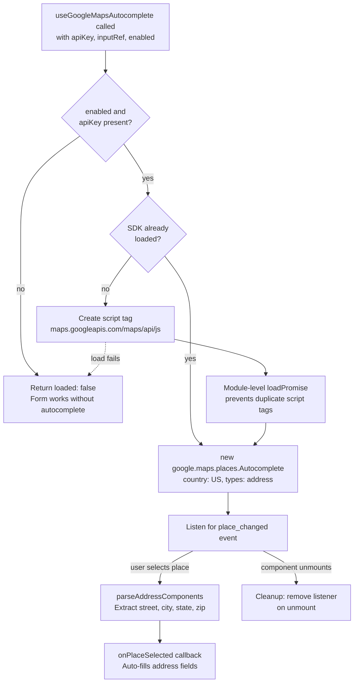

# Google Maps Autocomplete Lifecycle

How the useGoogleMapsAutocomplete hook lazily loads the Google Maps SDK and wires up address autocomplete.

```mermaid
flowchart TD
    Start["useGoogleMapsAutocomplete called<br/>with apiKey, inputRef, enabled"]
    CheckEnabled{"enabled and<br/>apiKey present?"}
    Skip["Return loaded: false<br/>Form works without autocomplete"]
    CheckLoaded{"SDK already<br/>loaded?"}
    InjectScript["Create script tag<br/>maps.googleapis.com/maps/api/js"]
    Dedup["Module-level loadPromise<br/>prevents duplicate script tags"]
    InitAutocomplete["new google.maps.places.Autocomplete<br/>country: US, types: address"]
    Listen["Listen for place_changed event"]
    Parse["parseAddressComponents<br/>Extract street, city, state, zip"]
    Fill["onPlaceSelected callback<br/>Auto-fills address fields"]
    Cleanup["Cleanup: remove listener<br/>on unmount"]

    Start --> CheckEnabled
    CheckEnabled -->|"no"| Skip
    CheckEnabled -->|"yes"| CheckLoaded
    CheckLoaded -->|"yes"| InitAutocomplete
    CheckLoaded -->|"no"| InjectScript
    InjectScript --> Dedup
    Dedup --> InitAutocomplete
    InitAutocomplete --> Listen
    Listen -->|"user selects place"| Parse
    Parse --> Fill
    Listen -->|"component unmounts"| Cleanup
    InjectScript -.->|"load fails"| Skip
```
