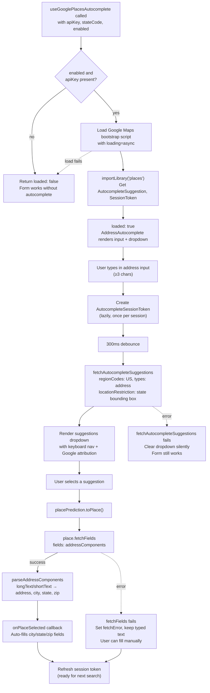

# Google Places Autocomplete Lifecycle

How the useGooglePlacesAutocomplete hook lazily loads the Google Maps SDK and provides address autocomplete via the Data API.

```mermaid
flowchart TD
    Start["useGooglePlacesAutocomplete called<br/>with apiKey, stateCode, enabled"]
    CheckEnabled{"enabled and<br/>apiKey present?"}
    Skip["Return loaded: false<br/>Form works without autocomplete"]
    LoadBootstrap["Load Google Maps bootstrap script<br/>with loading=async"]
    ImportLib["importLibrary('places')<br/>Get AutocompleteSuggestion, SessionToken"]
    Ready["loaded: true<br/>AddressAutocomplete renders input + dropdown"]

    UserTypes["User types in address input<br/>(≥3 chars)"]
    CreateToken["Create AutocompleteSessionToken<br/>(lazily, once per session)"]
    Debounce["300ms debounce"]
    FetchSuggestions["fetchAutocompleteSuggestions<br/>regionCodes: US, types: address<br/>locationRestriction: state bounding box"]
    ShowDropdown["Render suggestions dropdown<br/>with keyboard nav + Google attribution"]

    SelectPlace["User selects a suggestion"]
    ToPlace["placePrediction.toPlace()"]
    FetchFields["place.fetchFields<br/>fields: addressComponents"]
    Parse["parseAddressComponents<br/>longText/shortText → address, city, state, zip"]
    Fill["onPlaceSelected callback<br/>Auto-fills city/state/zip fields"]
    RefreshToken["Refresh session token<br/>(ready for next search)"]

    FetchFail["fetchFields fails<br/>Set fetchError, keep typed text<br/>User can fill manually"]
    SuggestionsFail["fetchAutocompleteSuggestions fails<br/>Clear dropdown silently<br/>Form still works"]

    Start --> CheckEnabled
    CheckEnabled -->|"no"| Skip
    CheckEnabled -->|"yes"| LoadBootstrap
    LoadBootstrap --> ImportLib
    ImportLib --> Ready
    LoadBootstrap -.->|"load fails"| Skip

    Ready --> UserTypes
    UserTypes --> CreateToken
    CreateToken --> Debounce
    Debounce --> FetchSuggestions
    FetchSuggestions --> ShowDropdown
    FetchSuggestions -.->|"error"| SuggestionsFail

    ShowDropdown --> SelectPlace
    SelectPlace --> ToPlace
    ToPlace --> FetchFields
    FetchFields -->|"success"| Parse
    Parse --> Fill
    Fill --> RefreshToken
    FetchFields -.->|"error"| FetchFail
    FetchFail --> RefreshToken
```
