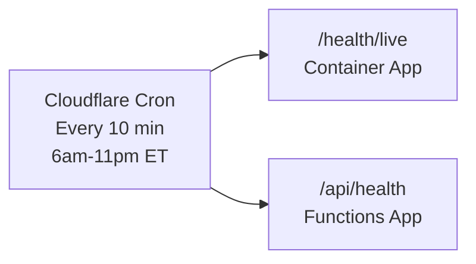

# Keep-Alive Ping Design

## Problem

Both the API (Container Apps, scale-to-zero) and Functions (Y1 Consumption) go cold after ~20 minutes of inactivity. Cold starts add 5-10 seconds of latency on the first request. For the activation pipeline (queue-triggered, background), this is acceptable. For lead form submissions and API health checks proxied through Cloudflare, cold starts cause visible user-facing delays.

## Design

A lightweight external ping runs on a schedule to keep both services warm during business hours.

### Option A: Cloudflare Worker Cron Trigger (recommended)

A Cloudflare Worker with a cron trigger pings both endpoints every 10 minutes during business hours (6am-11pm ET). Free — Cloudflare Workers cron triggers are included in the free plan.



**Implementation:**
```js
// workers/keep-alive/index.js
export default {
  async scheduled(event, env) {
    const targets = [
      'https://api.real-estate-star.com/health/live',
      'https://real-estate-star-functions-v4.azurewebsites.net/api/health',
    ];
    await Promise.allSettled(
      targets.map(url => fetch(url, { method: 'GET' }))
    );
  },
};
```

```toml
# workers/keep-alive/wrangler.toml
name = "real-estate-star-keep-alive"
[triggers]
crons = ["*/10 6-23 * * *"]  # Every 10 min, 6am-11pm UTC (adjust for ET)
```

**Cost:** $0 (Cloudflare Workers free plan includes cron triggers)

### Option B: GitHub Actions Scheduled Workflow

A GitHub Actions workflow runs on a cron schedule and curls the health endpoints.

**Cost:** $0 (GitHub Actions free tier includes scheduled workflows)
**Drawback:** GitHub Actions cron has ~5 minute jitter and can be delayed during high-demand periods.

### Option C: Azure Logic App (Free tier)

An Azure Logic App with a recurrence trigger calls both health endpoints.

**Cost:** $0 for first 5,000 actions/month (free tier)
**Drawback:** Adds another Azure resource to manage.

## Recommendation

**Option A (Cloudflare Worker)** — consistent with our "Cloudflare for everything hosting-related" preference. Zero cost, no Azure dependency, no GitHub Actions jitter. Deploys alongside the other Cloudflare Workers we already manage.

## Why Not Always-Ready Instances?

The Flex Consumption plan we're migrating FROM had 1 always-ready instance ($15-20/mo). The Y1 plan we're migrating TO doesn't support always-ready. The keep-alive ping achieves the same effect (warm instance during business hours) at $0 cost, with the trade-off that off-hours requests (11pm-6am) may cold-start.

For the activation pipeline specifically: activation is triggered by queue messages after OAuth authorization, which only happens during business hours when the agent is actively setting up. Lead form submissions are also primarily business hours. The 11pm-6am cold start window is acceptable.
