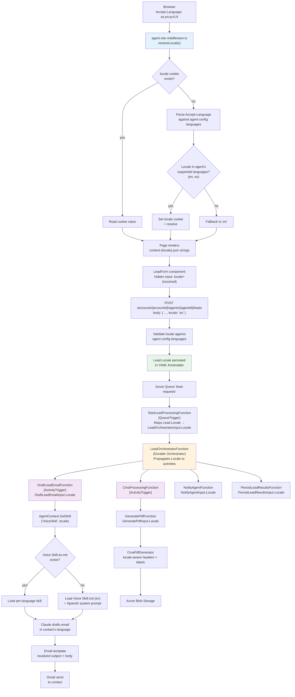

# Language Locale Flow

End-to-end flow of locale resolution from browser through the Durable Functions lead pipeline to email delivery. `Lead.Locale` flows through `LeadOrchestratorInput.Locale` into all downstream DF activity DTOs.

## Key Decisions

| Decision | Rationale |
|----------|-----------|
| Cookie takes priority over Accept-Language | User's explicit choice (language picker) overrides browser default |
| Locale validated server-side against agent config | Prevents arbitrary locale injection; only `en` and `es` accepted |
| Fallback to English skill + translation prompt | Agents with insufficient Spanish corpus still serve Spanish leads |
| Agent notifications always in English | Agent manages their pipeline in one language |
| TCPA consent stays English | Legal requirement regardless of contact locale |
