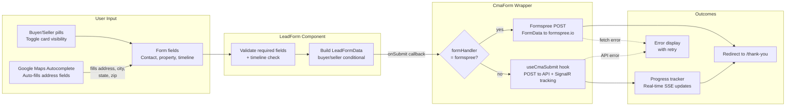

# Lead Form Data Flow

How lead data flows from user input through submission to either Formspree or the CMA API.

```mermaid
flowchart LR
    subgraph UserInput ["User Input"]
        Pills["Buyer/Seller pills<br/>Toggle card visibility"]
        GMaps["Google Maps Autocomplete<br/>Auto-fills address fields"]
        Fields["Form fields<br/>Contact, property, timeline"]
    end

    subgraph LeadForm ["LeadForm Component"]
        Validate["Validate required fields<br/>+ timeline check"]
        Build["Build LeadFormData<br/>buyer/seller conditional"]
    end

    subgraph CmaFormWrapper ["CmaForm Wrapper"]
        ModeCheck{"formHandler<br/>= formspree?"}
        Formspree["Formspree POST<br/>FormData to formspree.io"]
        ApiMode["useCmaSubmit hook<br/>POST to API + SignalR tracking"]
    end

    subgraph Outcomes ["Outcomes"]
        ThankYou["Redirect to /thank-you"]
        Progress["Progress tracker<br/>Real-time SSE updates"]
        Error["Error display<br/>with retry"]
    end

    Pills --> Fields
    GMaps -->|"fills address, city,<br/>state, zip"| Fields
    Fields --> Validate
    Validate --> Build
    Build -->|"onSubmit callback"| ModeCheck
    ModeCheck -->|"yes"| Formspree
    ModeCheck -->|"no"| ApiMode
    Formspree --> ThankYou
    ApiMode --> Progress
    Formspree -.->|"fetch error"| Error
    ApiMode -.->|"API error"| Error
    Progress --> ThankYou
```
