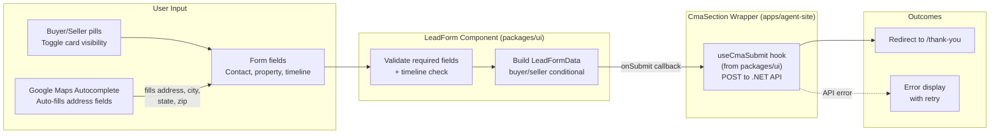

# Lead Form Data Flow

How lead data flows from user input through submission to the .NET CMA API.

```mermaid
flowchart LR
    subgraph UserInput ["User Input"]
        Pills["Buyer/Seller pills<br/>Toggle card visibility"]
        GMaps["Google Maps Autocomplete<br/>Auto-fills address fields"]
        Fields["Form fields<br/>Contact, property, timeline"]
    end

    subgraph LeadForm ["LeadForm Component (packages/ui)"]
        Validate["Validate required fields<br/>+ timeline check"]
        Build["Build LeadFormData<br/>buyer/seller conditional"]
    end

    subgraph CmaSectionWrapper ["CmaSection Wrapper (apps/agent-site)"]
        Submit["useCmaSubmit hook<br/>(from packages/ui)<br/>POST to .NET API"]
    end

    subgraph Outcomes ["Outcomes"]
        ThankYou["Redirect to /thank-you"]
        Error["Error display<br/>with retry"]
    end

    Pills --> Fields
    GMaps -->|"fills address, city,<br/>state, zip"| Fields
    Fields --> Validate
    Validate --> Build
    Build -->|"onSubmit callback"| Submit
    Submit --> ThankYou
    Submit -.->|"API error"| Error
```
