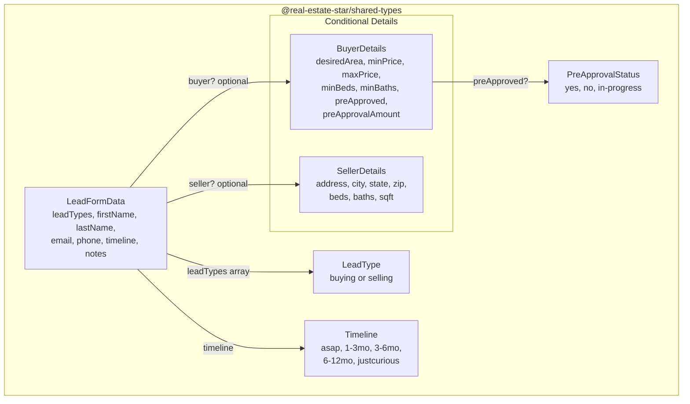

# Lead Form Data Model

Shared type hierarchy for lead capture across buyer and seller flows.

```mermaid
flowchart TD
    subgraph SharedTypes ["@real-estate-star/shared-types"]
        LFD["LeadFormData<br/>leadTypes, firstName, lastName,<br/>email, phone, timeline, notes"]
        LT["LeadType<br/>buying or selling"]
        TL["Timeline<br/>asap, 1-3mo, 3-6mo,<br/>6-12mo, justcurious"]

        subgraph Conditional ["Conditional Details"]
            BD["BuyerDetails<br/>desiredArea, minPrice, maxPrice,<br/>minBeds, minBaths, preApproved,<br/>preApprovalAmount"]
            SD["SellerDetails<br/>address, city, state, zip,<br/>beds, baths, sqft"]
        end

        PA["PreApprovalStatus<br/>yes, no, in-progress"]
    end

    LFD -->|"leadTypes array"| LT
    LFD -->|"timeline"| TL
    LFD -->|"buyer? optional"| BD
    LFD -->|"seller? optional"| SD
    BD -->|"preApproved?"| PA
```
