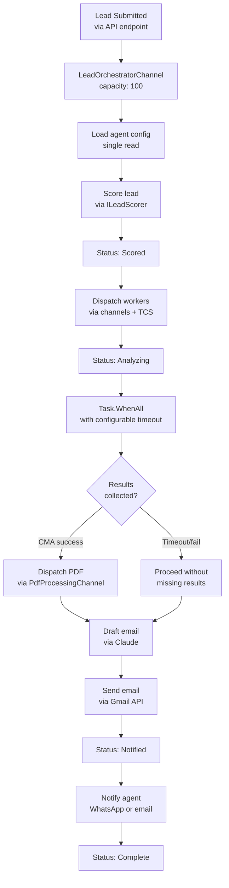

# Lead Orchestrator Flow

The LeadOrchestrator coordinates the full lead pipeline: scoring, worker dispatch, PDF generation, email drafting, and agent notification.

```mermaid
flowchart TD
    Submit["Lead Submitted<br/>via API endpoint"] --> Channel["LeadOrchestratorChannel<br/>capacity: 100"]
    Channel --> Load["Load agent config<br/>single read"]
    Load --> Score["Score lead<br/>via ILeadScorer"]
    Score --> Status1["Status: Scored"]
    Status1 --> Dispatch["Dispatch workers<br/>via channels + TCS"]
    Dispatch --> Status2["Status: Analyzing"]

    Status2 --> WhenAll["Task.WhenAll<br/>with configurable timeout"]

    WhenAll --> Collect{"Results<br/>collected?"}
    Collect -->|"CMA success"| PDF["Dispatch PDF<br/>via PdfProcessingChannel"]
    Collect -->|"Timeout/fail"| Skip["Proceed without<br/>missing results"]
    PDF --> Draft["Draft email<br/>via Claude"]
    Skip --> Draft

    Draft --> Send["Send email<br/>via Gmail API"]
    Send --> Status3["Status: Notified"]
    Status3 --> Notify["Notify agent<br/>WhatsApp or email"]
    Notify --> Status4["Status: Complete"]
```
