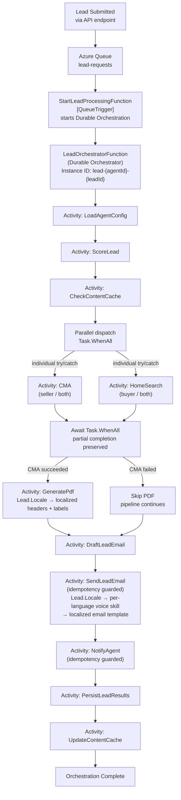

# Lead Orchestrator Flow

The LeadOrchestratorFunction coordinates the full lead pipeline as a Durable Function orchestration: scoring, activity dispatch, parallel CMA + Home Search, PDF generation, email drafting, and agent notification.

## Key Design Properties

| Property | Detail |
|----------|--------|
| **Instance ID** | `lead-{agentId}-{leadId}` — deterministic, prevents duplicate orchestrations |
| **Partial completion** | CMA and HomeSearch run in parallel with individual `try/catch` — one failure does not abort the pipeline |
| **Idempotency** | `SendLeadEmail` and `NotifyAgent` are guarded against duplicate sends on replay |
| **Checkpoint/resume** | Handled automatically by the Durable Functions execution history (stored in Azure Table Storage) |
| **Retry** | Handled by DF `RetryPolicy` (maxAttempts: 4, 30s backoff, 2x coefficient) |
| **Locale flow** | `Lead.Locale` (from form submission) flows to `DraftLeadEmail` (loads per-language voice skill via `AgentContext.GetSkill`), `GeneratePdf` (localized CMA headers/labels), and `SendLeadEmail` (localized email template). Agent notification is always English. |
