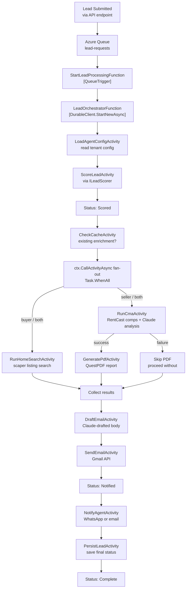

# Lead Orchestrator Flow

The LeadOrchestratorFunction coordinates the full lead pipeline: scoring, activity dispatch, PDF generation, email drafting, and agent notification.

```mermaid
flowchart TD
    Submit["Lead Submitted\nvia API endpoint"] --> Queue["Azure Queue\nlead-requests"]
    Queue --> Start["StartLeadProcessingFunction\n[QueueTrigger]"]
    Start --> Orch["LeadOrchestratorFunction\n[DurableClient.StartNewAsync]"]

    Orch --> LoadConfig["LoadAgentConfigActivity\nread tenant config"]
    LoadConfig --> Score["ScoreLeadActivity\nvia ILeadScorer"]
    Score --> Status1["Status: Scored"]
    Status1 --> CheckCache["CheckCacheActivity\nexisting enrichment?"]

    CheckCache --> Parallel["ctx.CallActivityAsync fan-out\nTask.WhenAll"]

    Parallel -->|"seller / both"| CMA["RunCmaActivity\nRentCast comps + Claude analysis"]
    Parallel -->|"buyer / both"| HomeSearch["RunHomeSearchActivity\nscaper listing search"]

    CMA -->|"success"| PDF["GeneratePdfActivity\nQuestPDF report"]
    CMA -->|"failure"| Skip["Skip PDF\nproceed without"]
    HomeSearch --> Collect["Collect results"]
    PDF --> Collect
    Skip --> Collect

    Collect --> Draft["DraftEmailActivity\nClaude-drafted body"]
    Draft --> Send["SendEmailActivity\nGmail API"]
    Send --> Status3["Status: Notified"]
    Status3 --> Notify["NotifyAgentActivity\nWhatsApp or email"]
    Notify --> Persist["PersistLeadActivity\nsave final status"]
    Persist --> Status4["Status: Complete"]
```
