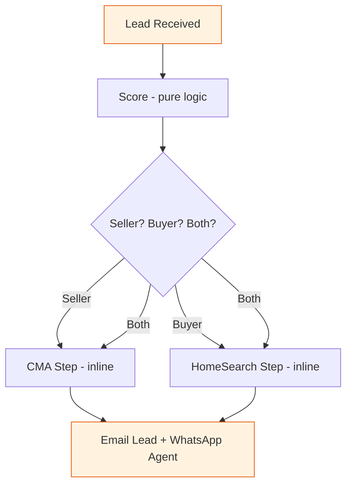
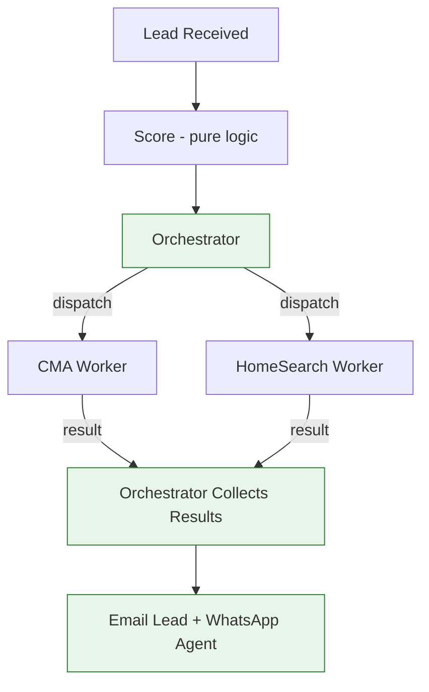
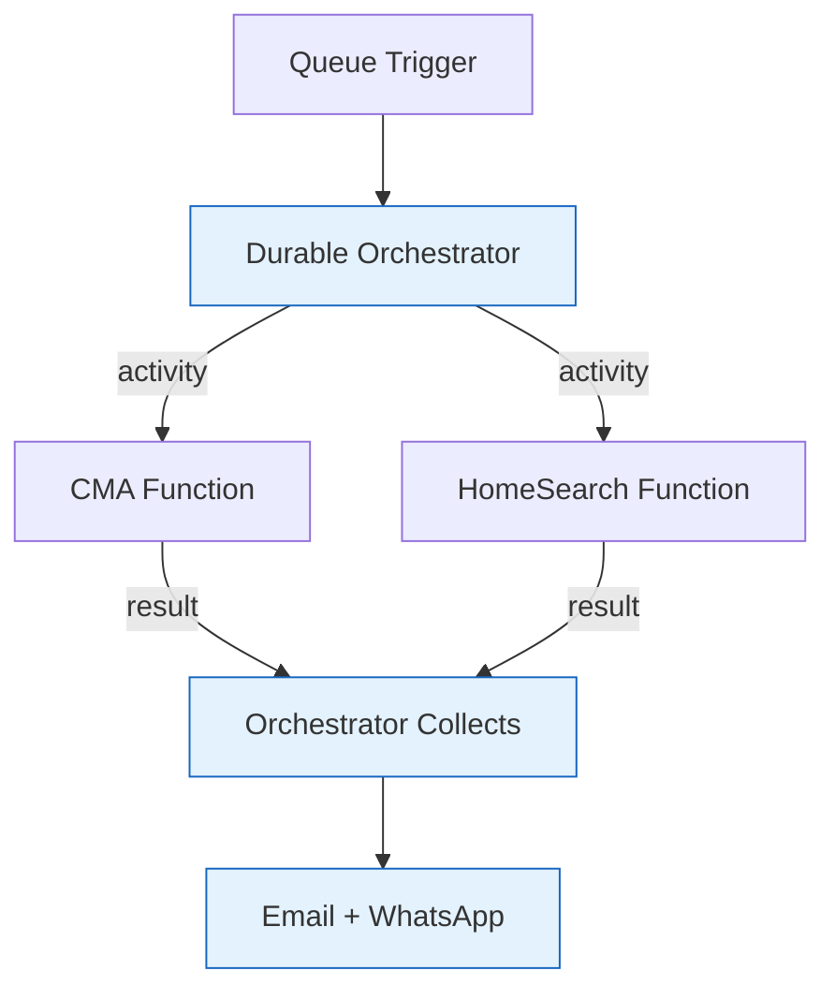

# Lead Pipeline — Approach A vs C

## Approach A: Rewrite Worker

Everything runs inside one `LeadProcessingWorker`. CMA and HomeSearch are inline steps.

**Pros:** Simple, fewer moving parts, fast to build.
**Cons:** Tightly coupled. Moving to Azure Functions later = full rewrite.

---

## Approach C: Orchestrator Pattern (Recommended)

An orchestrator dispatches CMA/HomeSearch as independent workers, collects results, then triggers notifications.

**Pros:** Workers are decoupled. Maps 1:1 to Azure Functions later. No second rewrite.
**Cons:** More upfront work — needs a completion/callback mechanism.

---

## Future: Azure Functions Migration

Approach C maps directly to Azure Durable Functions with no architectural changes.

**Key insight:** In Approach A, the lead worker *is* the pipeline. In Approach C, the orchestrator *coordinates* independent workers. That separation is what makes the Azure Functions migration trivial.

---

## Summary

| | Approach A | Approach C |
|---|---|---|
| Complexity | Low | Medium |
| CMA/HomeSearch coupling | Inline steps | Independent workers |
| Azure Functions migration | Full rewrite | 1:1 mapping |
| Notification trigger | After last step | After orchestrator collects |
| Recommended | No | **Yes** |
