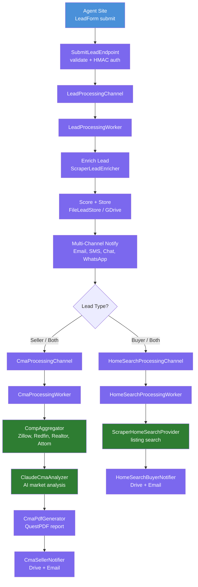

# Lead Processing Pipeline

How leads flow from submission through enrichment to parallel CMA and Home Search pipelines.

```mermaid
flowchart TD
    Submit["Agent Site<br/>LeadForm submit"]
    Endpoint["SubmitLeadEndpoint<br/>validate + HMAC auth"]
    LeadCh["LeadProcessingChannel"]
    LeadWorker["LeadProcessingWorker"]
    Enrich["Enrich Lead<br/>ScraperLeadEnricher"]
    Score["Score + Store<br/>FileLeadStore / GDrive"]
    Notify["Multi-Channel Notify<br/>Email, SMS, Chat, WhatsApp"]

    Decision{"Lead Type?"}

    CmaCh["CmaProcessingChannel"]
    CmaWorker["CmaProcessingWorker"]
    Comps["CompAggregator<br/>Zillow, Redfin, Realtor, Attom"]
    Analysis["ClaudeCmaAnalyzer<br/>AI market analysis"]
    Pdf["CmaPdfGenerator<br/>QuestPDF report"]
    CmaNotify["CmaSellerNotifier<br/>Drive + Email"]

    HsCh["HomeSearchProcessingChannel"]
    HsWorker["HomeSearchProcessingWorker"]
    Search["ScraperHomeSearchProvider<br/>listing search"]
    HsNotify["HomeSearchBuyerNotifier<br/>Drive + Email"]

    Submit --> Endpoint
    Endpoint --> LeadCh
    LeadCh --> LeadWorker
    LeadWorker --> Enrich
    Enrich --> Score
    Score --> Notify
    Notify --> Decision

    Decision -->|"Seller / Both"| CmaCh
    Decision -->|"Buyer / Both"| HsCh

    CmaCh --> CmaWorker
    CmaWorker --> Comps
    Comps --> Analysis
    Analysis --> Pdf
    Pdf --> CmaNotify

    HsCh --> HsWorker
    HsWorker --> Search
    Search --> HsNotify

    style Submit fill:#4A90D9,color:#fff
    style Endpoint fill:#7B68EE,color:#fff
    style LeadCh fill:#7B68EE,color:#fff
    style LeadWorker fill:#7B68EE,color:#fff
    style Enrich fill:#7B68EE,color:#fff
    style Score fill:#7B68EE,color:#fff
    style Notify fill:#7B68EE,color:#fff
    style CmaCh fill:#7B68EE,color:#fff
    style CmaWorker fill:#7B68EE,color:#fff
    style Comps fill:#2E7D32,color:#fff
    style Analysis fill:#2E7D32,color:#fff
    style Pdf fill:#7B68EE,color:#fff
    style CmaNotify fill:#7B68EE,color:#fff
    style HsCh fill:#7B68EE,color:#fff
    style HsWorker fill:#7B68EE,color:#fff
    style Search fill:#2E7D32,color:#fff
    style HsNotify fill:#7B68EE,color:#fff
```
