# Lead Processing Pipeline

How leads flow from submission through enrichment to parallel CMA and Home Search pipelines.
Uses a **checkpoint/resume** pattern — each step saves output before proceeding, retries skip completed steps.

```mermaid
flowchart TD
    Submit["Agent Site<br/>LeadForm + Turnstile"]
    Endpoint["SubmitLeadEndpoint<br/>validate + HMAC auth"]
    Dedup{"Dedup<br/>GetByEmailAsync"}
    NewLead["Create new Lead"]
    UpdateLead["Merge existing Lead<br/>add seller/buyer details"]
    Save["Save Lead Profile.md<br/>+ consent triple-write"]
    LeadCh["LeadProcessingChannel"]
    LeadWorker["LeadProcessingWorker<br/>checkpoint/resume"]

    CheckEnrich{"Research &<br/>Insights.md<br/>exists?"}
    Enrich["Enrich Lead<br/>ScraperLeadEnricher + Claude"]
    SkipEnrich["Skip enrichment<br/>use cached result"]

    CheckDraft{"Notification<br/>Draft.md<br/>exists?"}
    Draft["Draft email<br/>save to disk"]
    SkipDraft["Skip draft<br/>use cached"]

    Notify["Send Notification<br/>retry 3x → dead letter"]

    Decision{"Lead Type?"}

    CmaCh["CmaProcessingChannel"]
    CmaWorker["CmaProcessingWorker"]
    Comps["CompAggregator<br/>Zillow, Redfin, Realtor, Attom"]
    Analysis["ClaudeCmaAnalyzer<br/>AI market analysis"]
    Pdf["CmaPdfGenerator<br/>QuestPDF report"]
    CmaNotify["CmaSellerNotifier<br/>Drive + Email"]

    HsCh["HomeSearchProcessingChannel"]
    HsWorker["HomeSearchProcessingWorker"]
    Search["ScraperHomeSearchProvider<br/>listing search"]
    HsNotify["HomeSearchBuyerNotifier<br/>Drive + Email"]

    Submit --> Endpoint
    Endpoint --> Dedup
    Dedup -->|"Not found"| NewLead
    Dedup -->|"Exists"| UpdateLead
    NewLead --> Save
    UpdateLead --> Save
    Save --> LeadCh
    LeadCh --> LeadWorker

    LeadWorker --> CheckEnrich
    CheckEnrich -->|"No"| Enrich
    CheckEnrich -->|"Yes"| SkipEnrich
    Enrich --> CheckDraft
    SkipEnrich --> CheckDraft

    CheckDraft -->|"No"| Draft
    CheckDraft -->|"Yes"| SkipDraft
    Draft --> Notify
    SkipDraft --> Notify

    Notify --> Decision

    Decision -->|"Seller / Both"| CmaCh
    Decision -->|"Buyer / Both"| HsCh

    CmaCh --> CmaWorker
    CmaWorker --> Comps
    Comps --> Analysis
    Analysis --> Pdf
    Pdf --> CmaNotify

    HsCh --> HsWorker
    HsWorker --> Search
    Search --> HsNotify

    style Submit fill:#4A90D9,color:#fff
    style Endpoint fill:#7B68EE,color:#fff
    style Dedup fill:#C8A951,color:#fff
    style NewLead fill:#7B68EE,color:#fff
    style UpdateLead fill:#C8A951,color:#fff
    style Save fill:#7B68EE,color:#fff
    style LeadCh fill:#7B68EE,color:#fff
    style LeadWorker fill:#7B68EE,color:#fff
    style CheckEnrich fill:#C8A951,color:#fff
    style Enrich fill:#2E7D32,color:#fff
    style SkipEnrich fill:#C8A951,color:#fff
    style CheckDraft fill:#C8A951,color:#fff
    style Draft fill:#7B68EE,color:#fff
    style SkipDraft fill:#C8A951,color:#fff
    style Notify fill:#7B68EE,color:#fff
    style CmaCh fill:#7B68EE,color:#fff
    style CmaWorker fill:#7B68EE,color:#fff
    style Comps fill:#2E7D32,color:#fff
    style Analysis fill:#2E7D32,color:#fff
    style Pdf fill:#7B68EE,color:#fff
    style CmaNotify fill:#7B68EE,color:#fff
    style HsCh fill:#7B68EE,color:#fff
    style HsWorker fill:#7B68EE,color:#fff
    style Search fill:#2E7D32,color:#fff
    style HsNotify fill:#7B68EE,color:#fff
```



## Status Progression

```
Received → Enriched → EmailDrafted → Notified → Complete
```

## Checkpoint Files

| Step | Checkpoint File | If exists, skip |
|------|----------------|-----------------|
| Enrichment | `Research & Insights.md` | Claude API + ScraperAPI calls |
| Email Draft | `Notification Draft.md` | Email body generation |
| CMA | Lead status ≥ `CmaComplete` | CMA pipeline dispatch |
| Home Search | Lead status ≥ `SearchComplete` | Home search dispatch |

## Lead Dedup

Same email re-submission updates the existing lead:
- Merges `LeadType` (Buyer + Seller → Both)
- Adds missing seller/buyer details
- Re-enqueues for processing (worker skips completed steps)

## Retry & Dead Letter

- Notification: 3 retries (30s/60s/90s delays) → dead letter JSON file
- Lead save: dead letter on failure, still returns 202
- Consent: dead letter on failure, still enqueues for processing
