# Lead Processing Pipeline

How leads flow from submission through enrichment to parallel CMA and Home Search activities.
Uses Azure Durable Functions — orchestration state is persisted automatically in Azure Table Storage; retries and timeouts are managed by the DF runtime.

```mermaid
flowchart TD
    Submit["Agent Site\nLeadForm + Turnstile"]
    Endpoint["SubmitLeadEndpoint\nvalidate + HMAC auth"]
    Dedup{"Dedup\nGetByEmailAsync"}
    NewLead["Create new Lead"]
    UpdateLead["Merge existing Lead\nadd seller/buyer details"]
    Save["Save Lead Profile\n+ consent triple-write"]
    Queue["Azure Queue\nlead-requests"]
    Start["StartLeadProcessingFunction\n[QueueTrigger]"]
    Orch["LeadOrchestratorFunction\n[Orchestrator]"]

    LoadConfig["LoadAgentConfigActivity"]
    Score["ScoreLeadActivity"]
    CheckCache["CheckCacheActivity\nenrichment exists?"]
    Enrich["EnrichLeadActivity\nScraperAPI + Claude"]

    Draft["DraftEmailActivity\nClaude-drafted body"]
    Notify["SendNotificationActivity\nGmail API, retry via DF policy"]

    Decision{"Lead Type?"}

    CmaAct["RunCmaActivity\nRentCast comps + Claude analysis"]
    PdfAct["GeneratePdfActivity\nQuestPDF report"]
    CmaNotify["NotifyCmaActivity\nAzure Blob + Email"]

    HsAct["RunHomeSearchActivity\nlisting search"]
    HsNotify["NotifyHomeSearchActivity\nAzure Blob + Email"]

    Submit --> Endpoint
    Endpoint --> Dedup
    Dedup -->|"Not found"| NewLead
    Dedup -->|"Exists"| UpdateLead
    NewLead --> Save
    UpdateLead --> Save
    Save --> Queue
    Queue --> Start
    Start --> Orch

    Orch --> LoadConfig
    LoadConfig --> Score
    Score --> CheckCache
    CheckCache -->|"No cached result"| Enrich
    CheckCache -->|"Cached"| Draft
    Enrich --> Draft

    Draft --> Parallel["ctx.CallActivityAsync fan-out\nTask.WhenAll"]
    Parallel --> Notify
    Parallel --> Decision

    Decision -->|"Seller / Both"| CmaAct
    Decision -->|"Buyer / Both"| HsAct

    CmaAct -->|"success"| PdfAct
    CmaAct -->|"failure"| CmaNotify
    PdfAct --> CmaNotify

    HsAct --> HsNotify

    style Submit fill:#4A90D9,color:#fff
    style Endpoint fill:#7B68EE,color:#fff
    style Dedup fill:#C8A951,color:#fff
    style NewLead fill:#7B68EE,color:#fff
    style UpdateLead fill:#C8A951,color:#fff
    style Save fill:#7B68EE,color:#fff
    style Queue fill:#7B68EE,color:#fff
    style Start fill:#7B68EE,color:#fff
    style Orch fill:#7B68EE,color:#fff
    style LoadConfig fill:#7B68EE,color:#fff
    style Score fill:#7B68EE,color:#fff
    style CheckCache fill:#C8A951,color:#fff
    style Enrich fill:#2E7D32,color:#fff
    style Draft fill:#7B68EE,color:#fff
    style Parallel fill:#C8A951,color:#fff
    style Notify fill:#7B68EE,color:#fff
    style CmaAct fill:#7B68EE,color:#fff
    style PdfAct fill:#7B68EE,color:#fff
    style CmaNotify fill:#7B68EE,color:#fff
    style HsAct fill:#7B68EE,color:#fff
    style HsNotify fill:#7B68EE,color:#fff
```



## Status Progression

```
Received → Scored → Enriched → EmailDrafted → Notified → Complete
```

## Durable Functions Retry Policy

| Activity | Retry Policy | Max Attempts |
|----------|-------------|--------------|
| EnrichLeadActivity | Exponential backoff | 3 |
| RunCmaActivity | Exponential backoff | 3 |
| RunHomeSearchActivity | Exponential backoff | 3 |
| SendNotificationActivity | Fixed 30s intervals | 3 |
| GeneratePdfActivity | Exponential backoff | 2 |

Orchestration state is persisted in Azure Table Storage after every activity completes. On restart, the DF runtime replays history and skips already-completed activities automatically — no manual checkpoint files required.

## Lead Dedup

Same email re-submission updates the existing lead:
- Merges `LeadType` (Buyer + Seller → Both)
- Adds missing seller/buyer details
- Re-enqueues to Azure Queue (orchestrator skips activities whose output is already persisted in history)
