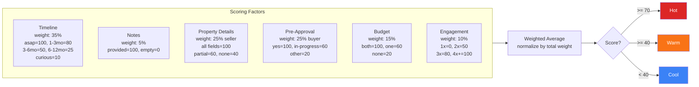

# Lead Scoring with Engagement Factor

Pure-logic scoring based on form data + repeat submission count. No external calls.

```mermaid
flowchart LR
    subgraph Factors ["Scoring Factors"]
        TL["Timeline<br/>weight: 35%<br/>asap=100, 1-3mo=80<br/>3-6mo=50, 6-12mo=25<br/>curious=10"]
        NT["Notes<br/>weight: 5%<br/>provided=100, empty=0"]
        PD["Property Details<br/>weight: 25% seller<br/>all fields=100<br/>partial=60, none=40"]
        PA["Pre-Approval<br/>weight: 25% buyer<br/>yes=100, in-progress=60<br/>other=20"]
        BG["Budget<br/>weight: 15%<br/>both=100, one=60<br/>none=20"]
        EN["Engagement<br/>weight: 10%<br/>1x=0, 2x=50<br/>3x=80, 4x+=100"]
    end

    Factors --> Normalize["Weighted Average<br/>normalize by total weight"]
    Normalize --> Bucket{"Score?"}
    Bucket -->|">= 70"| Hot["Hot"]
    Bucket -->|">= 40"| Warm["Warm"]
    Bucket -->|"< 40"| Cool["Cool"]

    style Hot fill:#dc2626,color:#fff
    style Warm fill:#f97316,color:#fff
    style Cool fill:#3b82f6,color:#fff
```
