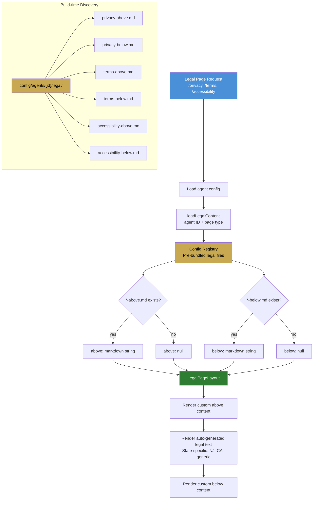

# Legal Content System

How above-the-fold and below-the-fold legal markdown files are discovered and rendered on legal pages.

```mermaid
flowchart TD
    A["Legal Page Request<br/>/privacy, /terms, /accessibility"] --> B["Load agent config"]
    B --> C["loadLegalContent<br/>agent ID + page type"]
    C --> D["Config Registry<br/>Pre-bundled legal files"]

    D --> E{"*-above.md exists?"}
    E -->|yes| F["above: markdown string"]
    E -->|no| G["above: null"]

    D --> H{"*-below.md exists?"}
    H -->|yes| I["below: markdown string"]
    H -->|no| J["below: null"]

    F --> K["LegalPageLayout"]
    G --> K
    I --> K
    J --> K

    K --> L["Render custom above content"]
    L --> M["Render auto-generated legal text<br/>State-specific: NJ, CA, generic"]
    M --> N["Render custom below content"]

    subgraph Discovery ["Build-time Discovery"]
        D1["config/agents/{id}/legal/"] --> D2["privacy-above.md"]
        D1 --> D3["privacy-below.md"]
        D1 --> D4["terms-above.md"]
        D1 --> D5["terms-below.md"]
        D1 --> D6["accessibility-above.md"]
        D1 --> D7["accessibility-below.md"]
    end

    style A fill:#4A90D9,color:#fff
    style D fill:#C8A951,color:#000
    style K fill:#2E7D32,color:#fff
    style D1 fill:#C8A951,color:#000
```
