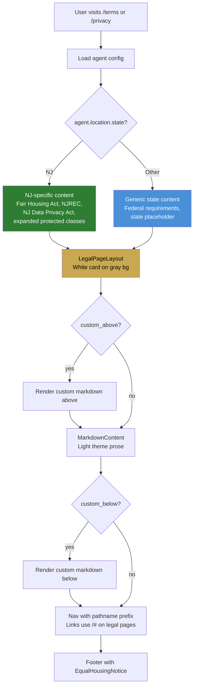

# Legal Page Rendering

How legal pages dynamically render state-specific content based on agent config.

```mermaid
flowchart TD
    Request["User visits /terms or /privacy"]
    Load["Load agent config"]
    State{"agent.location.state?"}
    NJ["NJ-specific content<br/>Fair Housing Act, NJREC,<br/>NJ Data Privacy Act,<br/>expanded protected classes"]
    Generic["Generic state content<br/>Federal requirements,<br/>state placeholder"]

    Layout["LegalPageLayout<br/>White card on gray bg"]
    MD["MarkdownContent<br/>Light theme prose"]
    Nav2["Nav with pathname prefix<br/>Links use /# on legal pages"]
    Footer2["Footer with EqualHousingNotice"]

    CustomAbove{"custom_above?"}
    CustomBelow{"custom_below?"}
    Above["Render custom markdown above"]
    Below["Render custom markdown below"]

    Request --> Load --> State
    State -->|"NJ"| NJ
    State -->|"Other"| Generic
    NJ --> Layout
    Generic --> Layout
    Layout --> CustomAbove
    CustomAbove -->|"yes"| Above --> MD
    CustomAbove -->|"no"| MD
    MD --> CustomBelow
    CustomBelow -->|"yes"| Below --> Nav2
    CustomBelow -->|"no"| Nav2
    Nav2 --> Footer2

    style NJ fill:#2E7D32,color:#fff
    style Generic fill:#4A90D9,color:#fff
    style Layout fill:#C8A951,color:#000
```
