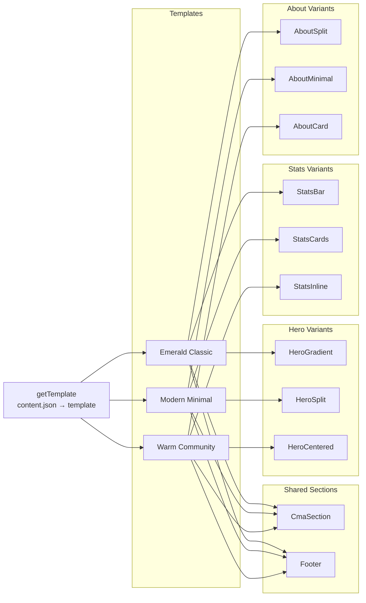

# Multi-Template Composition

How templates compose section variants from the shared component library.

```mermaid
flowchart LR
    subgraph Templates
        EC["Emerald Classic"]
        MM["Modern Minimal"]
        WC["Warm Community"]
    end

    subgraph "Shared Sections"
        CMA["CmaSection"]
        FT["Footer"]
    end

    subgraph "Hero Variants"
        HG["HeroGradient"]
        HS["HeroSplit"]
        HC["HeroCentered"]
    end

    subgraph "Stats Variants"
        SB["StatsBar"]
        SC["StatsCards"]
        SI["StatsInline"]
    end

    subgraph "About Variants"
        AS["AboutSplit"]
        AM["AboutMinimal"]
        AC["AboutCard"]
    end

    EC --> HG
    EC --> SB
    EC --> AS
    EC --> CMA
    EC --> FT

    MM --> HS
    MM --> SC
    MM --> AM
    MM --> CMA
    MM --> FT

    WC --> HC
    WC --> SI
    WC --> AC
    WC --> CMA
    WC --> FT

    Registry["getTemplate<br/>content.json → template"] --> EC
    Registry --> MM
    Registry --> WC
```
