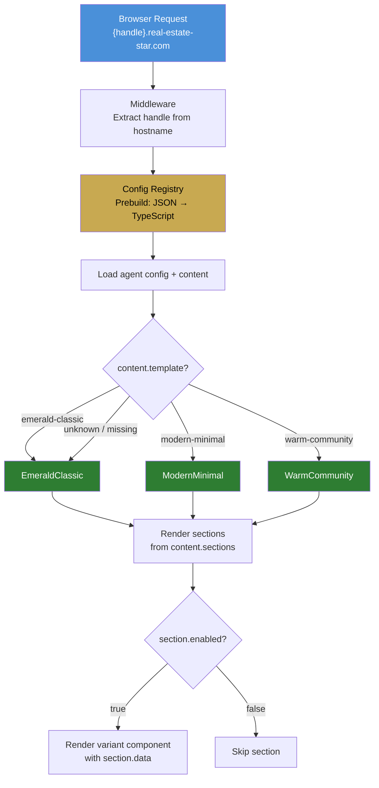

# Multi-Template Selection

How agent site requests are resolved to a specific template and its section variants.

```mermaid
flowchart TD
    A["Browser Request<br/>{handle}.real-estate-star.com"] --> B["Middleware<br/>Extract handle from hostname"]
    B --> C["Config Registry<br/>Prebuild: JSON → TypeScript"]
    C --> D["Load agent config + content"]
    D --> E{"content.template?"}
    E -->|"emerald-classic"| F["EmeraldClassic"]
    E -->|"modern-minimal"| G["ModernMinimal"]
    E -->|"warm-community"| H["WarmCommunity"]
    E -->|"unknown / missing"| F

    F --> I["Render sections<br/>from content.sections"]
    G --> I
    H --> I

    I --> J{"section.enabled?"}
    J -->|true| K["Render variant component<br/>with section.data"]
    J -->|false| L["Skip section"]

    style A fill:#4A90D9,color:#fff
    style C fill:#C8A951,color:#000
    style F fill:#2E7D32,color:#fff
    style G fill:#2E7D32,color:#fff
    style H fill:#2E7D32,color:#fff
```
