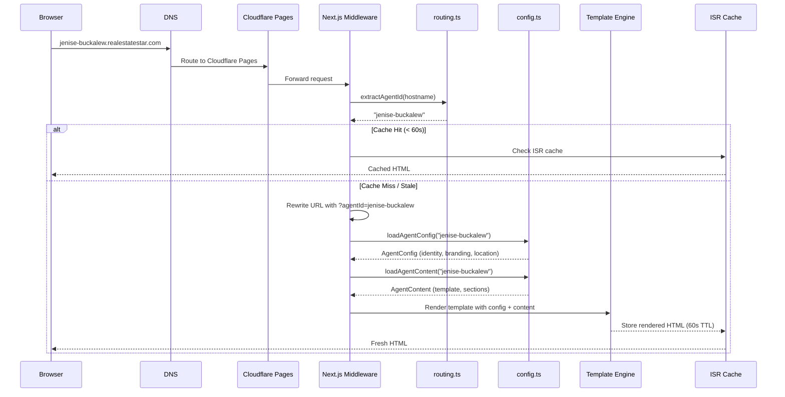
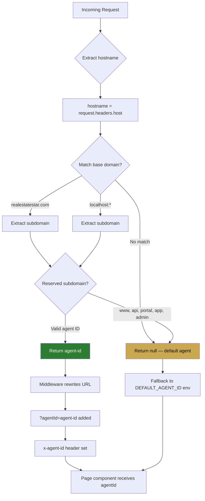

# Multi-Tenant Routing Architecture

## Request Flow

## Subdomain Extraction Logic

## Key Design Decisions

1. **Subdomain-based routing** — Each agent gets `{id}.realestatestar.com`, no path-based routing
2. **URL rewriting** — Middleware rewrites the URL rather than redirecting, preserving the clean subdomain URL
3. **Header propagation** — `x-agent-id` header set for downstream API calls
4. **ISR caching** — 60-second revalidation balances freshness with performance
5. **Fallback chain** — `searchParams.agentId` → `DEFAULT_AGENT_ID` env → `"jenise-buckalew"` hardcoded default
