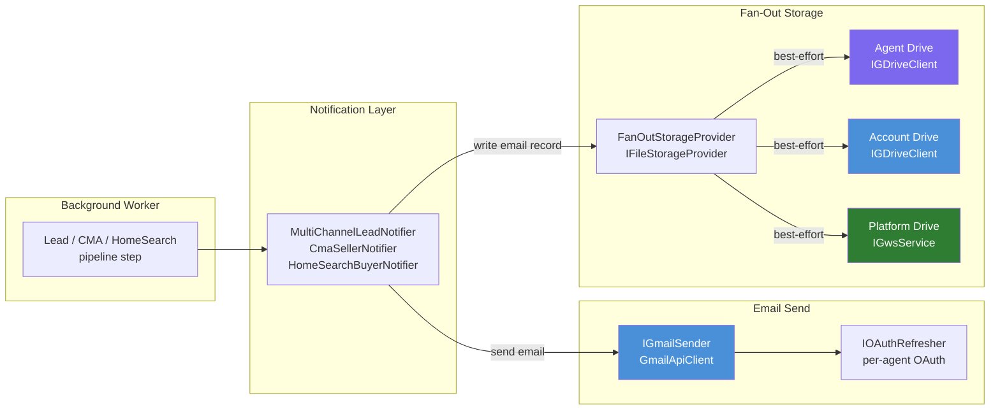

# Notification Email Flow

How lead notifications flow from pipeline worker through Gmail API with fan-out document storage.

```mermaid
flowchart LR
    subgraph Pipeline["Background Worker"]
        WORKER["Lead / CMA / HomeSearch<br/>pipeline step"]
    end

    subgraph Notification["Notification Layer"]
        NOTIFIER["MultiChannelLeadNotifier<br/>CmaSellerNotifier<br/>HomeSearchBuyerNotifier"]
    end

    subgraph Send["Email Send"]
        GMAIL["IGmailSender<br/>GmailApiClient"]
        TOKEN["IOAuthRefresher<br/>per-agent OAuth"]
    end

    subgraph FanOut["Fan-Out Storage"]
        FOP["FanOutStorageProvider<br/>IFileStorageProvider"]
        AGT["Agent Drive<br/>IGDriveClient"]
        ACCT["Account Drive<br/>IGDriveClient"]
        PLAT["Platform Drive<br/>IGwsService"]
    end

    WORKER --> NOTIFIER
    NOTIFIER -->|"send email"| GMAIL
    GMAIL --> TOKEN
    NOTIFIER -->|"write email record"| FOP
    FOP -->|"best-effort"| AGT
    FOP -->|"best-effort"| ACCT
    FOP -->|"best-effort"| PLAT

    style GMAIL fill:#4A90D9,color:#fff
    style AGT fill:#7B68EE,color:#fff
    style ACCT fill:#4A90D9,color:#fff
    style PLAT fill:#2E7D32,color:#fff
```
