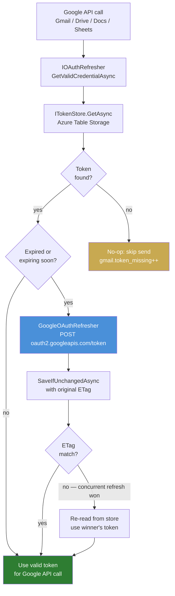

# OAuth Token Lifecycle

Token resolution flow from API call through refresh with optimistic concurrency.

```mermaid
flowchart TD
    REQ["Google API call<br/>Gmail / Drive / Docs / Sheets"]
    RESOLVE["IOAuthRefresher<br/>GetValidCredentialAsync"]
    GET["ITokenStore.GetAsync<br/>Azure Table Storage"]
    FOUND{"Token<br/>found?"}
    EXPIRED{"Expired or<br/>expiring soon?"}
    REFRESH["GoogleOAuthRefresher<br/>POST oauth2.googleapis.com/token"]
    SAVE["SaveIfUnchangedAsync<br/>with original ETag"]
    MATCH{"ETag<br/>match?"}
    REREAD["Re-read from store<br/>use winner's token"]
    USE["Use valid token<br/>for Google API call"]
    SKIP["No-op: skip send<br/>gmail.token_missing++"]

    REQ --> RESOLVE --> GET --> FOUND
    FOUND -->|"yes"| EXPIRED
    FOUND -->|"no"| SKIP
    EXPIRED -->|"no"| USE
    EXPIRED -->|"yes"| REFRESH --> SAVE --> MATCH
    MATCH -->|"yes"| USE
    MATCH -->|"no — concurrent refresh won"| REREAD --> USE

    style USE fill:#2E7D32,color:#fff
    style SKIP fill:#C8A951,color:#fff
    style REFRESH fill:#4A90D9,color:#fff
```
