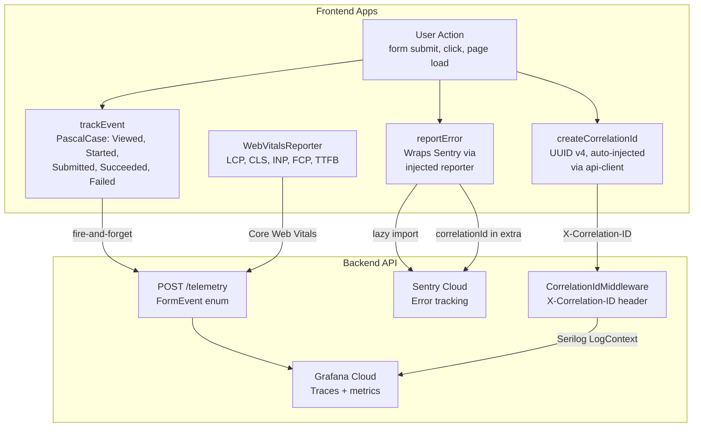

# Frontend Observability Flow

How telemetry, error tracking, and correlation IDs flow from frontend to backend.

```mermaid
flowchart TD
    subgraph Frontend ["Frontend Apps"]
        UserAction["User Action<br/>form submit, click, page load"]
        TrackEvent["trackEvent<br/>PascalCase: Viewed, Started,<br/>Submitted, Succeeded, Failed"]
        ReportError["reportError<br/>Wraps Sentry via<br/>injected reporter"]
        WebVitals["WebVitalsReporter<br/>LCP, CLS, INP, FCP, TTFB"]
        CorrelationID["createCorrelationId<br/>UUID v4, auto-injected<br/>via api-client"]
    end

    subgraph Backend ["Backend API"]
        TelemetryEndpoint["POST /telemetry<br/>FormEvent enum"]
        SentryCloud["Sentry Cloud<br/>Error tracking"]
        CorrelationMiddleware["CorrelationIdMiddleware<br/>X-Correlation-ID header"]
        GrafanaCloud["Grafana Cloud<br/>Traces + metrics"]
    end

    UserAction --> TrackEvent
    UserAction --> ReportError
    UserAction --> CorrelationID

    TrackEvent -->|"fire-and-forget"| TelemetryEndpoint
    ReportError -->|"lazy import"| SentryCloud
    WebVitals -->|"Core Web Vitals"| TelemetryEndpoint
    CorrelationID -->|"X-Correlation-ID"| CorrelationMiddleware

    TelemetryEndpoint --> GrafanaCloud
    CorrelationMiddleware -->|"Serilog LogContext"| GrafanaCloud
    ReportError -->|"correlationId in extra"| SentryCloud
```
