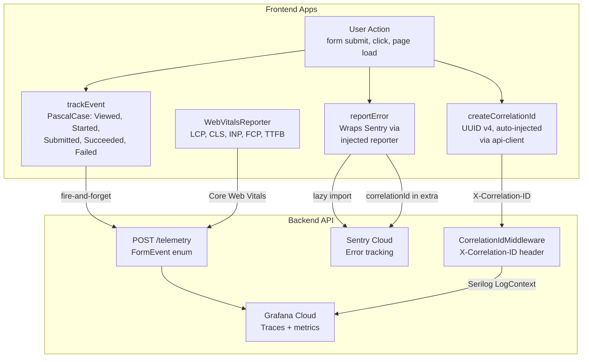

# Frontend Observability Flow

How telemetry, error tracking, and correlation IDs flow from frontend to backend.



## Correlation ID Flow

The `createApiClient()` from `@real-estate-star/api-client` auto-injects `X-Correlation-ID: crypto.randomUUID()` on every request. This correlation ID flows through the entire request lifecycle:

1. **Frontend**: Generated on first request via `createApiClient(baseUrl)` or shared `api` instance
2. **API**: Captured by `CorrelationIdMiddleware`, stored in Serilog LogContext
3. **Enrichment & Notification**: Propagated through worker pipelines via LogContext
4. **Grafana Dashboards**: Queryable via `correlation_id` field for end-to-end request tracing
```
