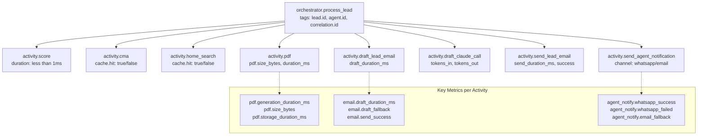

# Observability Span Tree

Every pipeline activity creates its own trace span as a child of the orchestrator span. All spans tagged with lead.id, agent.id, correlation.id.

```mermaid
flowchart TD
    Root["orchestrator.process_lead<br/>tags: lead.id, agent.id, correlation.id"]

    Root --> S1["activity.score<br/>duration: less than 1ms"]
    Root --> S2["activity.cma<br/>cache.hit: true/false"]
    Root --> S3["activity.home_search<br/>cache.hit: true/false"]
    Root --> S4["activity.pdf<br/>pdf.size_bytes, duration_ms"]
    Root --> S5["activity.draft_lead_email<br/>draft_duration_ms"]
    Root --> S5a["activity.draft_claude_call<br/>tokens_in, tokens_out"]
    Root --> S6["activity.send_lead_email<br/>send_duration_ms, success"]
    Root --> S7["activity.send_agent_notification<br/>channel: whatsapp/email"]

    subgraph Metrics ["Key Metrics per Activity"]
        M1["pdf.generation_duration_ms<br/>pdf.size_bytes<br/>pdf.storage_duration_ms"]
        M2["email.draft_duration_ms<br/>email.draft_fallback<br/>email.send_success"]
        M3["agent_notify.whatsapp_success<br/>agent_notify.whatsapp_failed<br/>agent_notify.email_fallback"]
    end

    S4 -.-> M1
    S5 -.-> M2
    S7 -.-> M3
```
