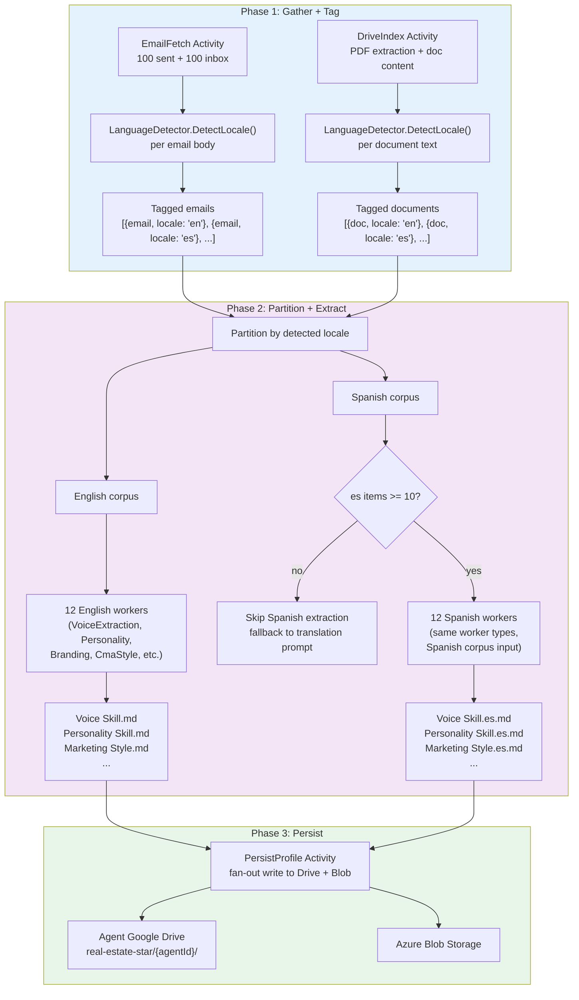

# Per-Language Skill Extraction

How the activation pipeline extracts per-language skill files from a bilingual agent's communications.

## File Naming Convention

| Locale | File Pattern | Example |
|--------|-------------|---------|
| `en` (default) | `{Skill Name}.md` | `Voice Skill.md` |
| `es` | `{Skill Name}.es.md` | `Voice Skill.es.md` |

English is the default and omits the locale suffix. All other locales use BCP 47 codes.

## Language Detection

`LanguageDetector.DetectLocale(text)` in `Domain/Shared/Services/`:

1. **Character-set heuristic:** Scores presence of accented characters and inverted punctuation
2. **Stop-word scoring:** Counts Spanish vs. English high-frequency words
3. **Threshold:** Requires 60% confidence; defaults to `en` below threshold

## Minimum Corpus Rule

Spanish workers only run when the tagged Spanish corpus has >= 10 items. Below this threshold, the agent's Spanish email drafts use the English voice skill with a Claude system prompt requesting Spanish output. This prevents low-quality skill extraction from insufficient data.

## Cost Impact

For bilingual agents, Phase 2 cost roughly doubles (24 workers instead of 12). Phase 1 cost is unchanged (tagging is a lightweight heuristic, not a Claude call). Estimated additional cost per activation: $0.40-$1.00 depending on corpus size.
