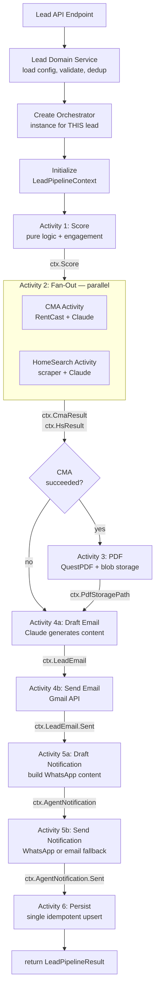

# Per-Lead Orchestrator Lifecycle

Each lead gets its own orchestrator instance that coordinates all pipeline activities through a shared context.

```mermaid
flowchart TD
    API["Lead API Endpoint"] --> DomainSvc["Lead Domain Service<br/>load config, validate, dedup"]
    DomainSvc --> Create["Create Orchestrator<br/>instance for THIS lead"]
    Create --> Ctx["Initialize<br/>LeadPipelineContext"]

    Ctx --> Score["Activity 1: Score<br/>pure logic + engagement"]
    Score -->|"ctx.Score"| FanOut

    subgraph FanOut ["Activity 2: Fan-Out — parallel"]
        CMA["CMA Activity<br/>RentCast + Claude"]
        HS["HomeSearch Activity<br/>scraper + Claude"]
    end

    FanOut -->|"ctx.CmaResult<br/>ctx.HsResult"| PdfCheck{"CMA<br/>succeeded?"}
    PdfCheck -->|"yes"| PDF["Activity 3: PDF<br/>QuestPDF + blob storage"]
    PdfCheck -->|"no"| DraftEmail
    PDF -->|"ctx.PdfStoragePath"| DraftEmail

    DraftEmail["Activity 4a: Draft Email<br/>Claude generates content"] -->|"ctx.LeadEmail"| SendEmail
    SendEmail["Activity 4b: Send Email<br/>Gmail API"] -->|"ctx.LeadEmail.Sent"| DraftAgent
    DraftAgent["Activity 5a: Draft Notification<br/>build WhatsApp content"] -->|"ctx.AgentNotification"| SendAgent
    SendAgent["Activity 5b: Send Notification<br/>WhatsApp or email fallback"] -->|"ctx.AgentNotification.Sent"| Persist

    Persist["Activity 6: Persist<br/>single idempotent upsert"] --> Done["return LeadPipelineResult"]
```
