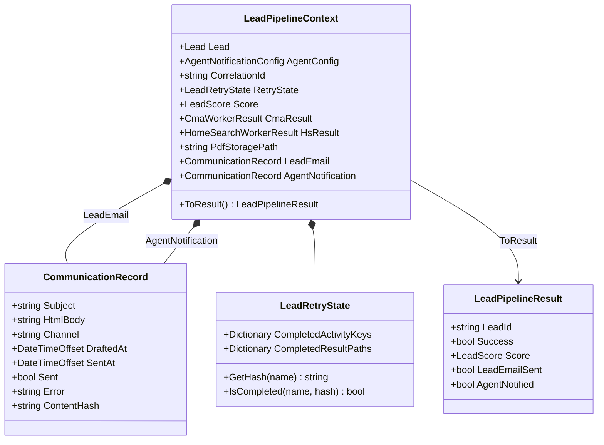

# Pipeline Context Data Flow

LeadPipelineContext is the single mutable context passed through all activities. Each activity reads what it needs and writes its output.

```mermaid
classDiagram
    class LeadPipelineContext {
        +Lead Lead
        +AgentNotificationConfig AgentConfig
        +string CorrelationId
        +LeadRetryState RetryState
        +LeadScore Score
        +CmaWorkerResult CmaResult
        +HomeSearchWorkerResult HsResult
        +string PdfStoragePath
        +CommunicationRecord LeadEmail
        +CommunicationRecord AgentNotification
        +ToResult() LeadPipelineResult
    }

    class CommunicationRecord {
        +string Subject
        +string HtmlBody
        +string Channel
        +DateTimeOffset DraftedAt
        +DateTimeOffset SentAt
        +bool Sent
        +string Error
        +string ContentHash
    }

    class LeadRetryState {
        +Dictionary CompletedActivityKeys
        +Dictionary CompletedResultPaths
        +GetHash(name) string
        +IsCompleted(name, hash) bool
    }

    class LeadPipelineResult {
        +string LeadId
        +bool Success
        +LeadScore Score
        +bool LeadEmailSent
        +bool AgentNotified
    }

    LeadPipelineContext *-- CommunicationRecord : LeadEmail
    LeadPipelineContext *-- CommunicationRecord : AgentNotification
    LeadPipelineContext *-- LeadRetryState
    LeadPipelineContext --> LeadPipelineResult : ToResult
```
