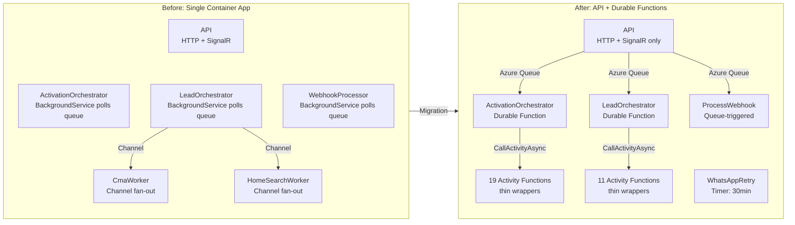

# Before vs After Architecture

Overview of the migration from in-process BackgroundServices to Azure Durable Functions.

```mermaid
flowchart LR
    subgraph Before ["Before: Single Container App"]
        API1["API<br/>HTTP + SignalR"]
        AO1["ActivationOrchestrator<br/>BackgroundService polls queue"]
        LO1["LeadOrchestrator<br/>BackgroundService polls queue"]
        CMA1["CmaWorker<br/>Channel fan-out"]
        HS1["HomeSearchWorker<br/>Channel fan-out"]
        WH1["WebhookProcessor<br/>BackgroundService polls queue"]

        API1 ~~~ AO1
        API1 ~~~ LO1
        LO1 -->|"Channel"| CMA1
        LO1 -->|"Channel"| HS1
        API1 ~~~ WH1
    end

    subgraph After ["After: API + Durable Functions"]
        API2["API<br/>HTTP + SignalR only"]
        AO2["ActivationOrchestrator<br/>Durable Function"]
        LO2["LeadOrchestrator<br/>Durable Function"]
        ACT2["19 Activity Functions<br/>thin wrappers"]
        LACT2["11 Activity Functions<br/>thin wrappers"]
        WH2["ProcessWebhook<br/>Queue-triggered"]
        WR2["WhatsAppRetry<br/>Timer: 30min"]

        API2 -->|"Azure Queue"| AO2
        API2 -->|"Azure Queue"| LO2
        API2 -->|"Azure Queue"| WH2
        AO2 -->|"CallActivityAsync"| ACT2
        LO2 -->|"CallActivityAsync"| LACT2
    end

    Before -->|"Migration"| After
```
