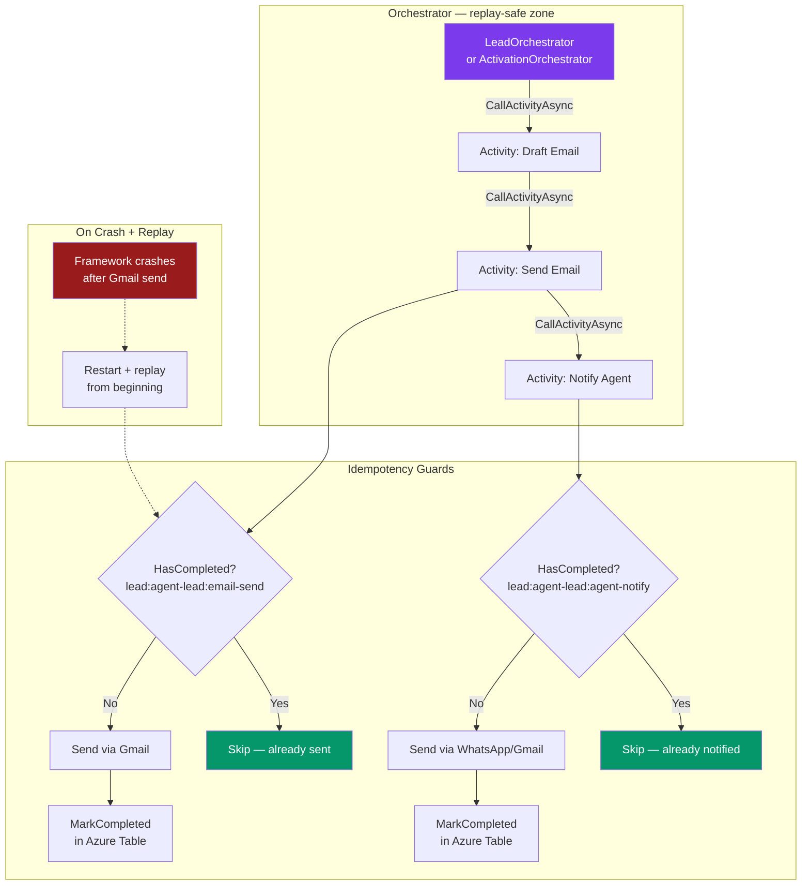

# Idempotency and Replay Safety

How the system prevents duplicate side effects during Durable Functions replay.

```mermaid
flowchart TD
    subgraph Orchestrator ["Orchestrator — replay-safe zone"]
        direction TB
        O["LeadOrchestrator<br/>or ActivationOrchestrator"]
        O -->|"CallActivityAsync"| A1["Activity: Draft Email"]
        A1 -->|"CallActivityAsync"| A2["Activity: Send Email"]
        A2 -->|"CallActivityAsync"| A3["Activity: Notify Agent"]
    end

    subgraph Guards ["Idempotency Guards"]
        direction TB
        A2 --> Check1{"HasCompleted?<br/>lead:agent-lead:email-send"}
        Check1 -->|"No"| Gmail["Send via Gmail"]
        Check1 -->|"Yes"| Skip1["Skip — already sent"]
        Gmail --> Mark1["MarkCompleted<br/>in Azure Table"]

        A3 --> Check2{"HasCompleted?<br/>lead:agent-lead:agent-notify"}
        Check2 -->|"No"| WA["Send via WhatsApp/Gmail"]
        Check2 -->|"Yes"| Skip2["Skip — already notified"]
        WA --> Mark2["MarkCompleted<br/>in Azure Table"]
    end

    subgraph Replay ["On Crash + Replay"]
        Crash["Framework crashes<br/>after Gmail send"] -.-> Restart["Restart + replay<br/>from beginning"]
        Restart -.-> Check1
    end

    style O fill:#7c3aed,color:#fff
    style Skip1 fill:#059669,color:#fff
    style Skip2 fill:#059669,color:#fff
    style Crash fill:#991b1b,color:#fff
```
